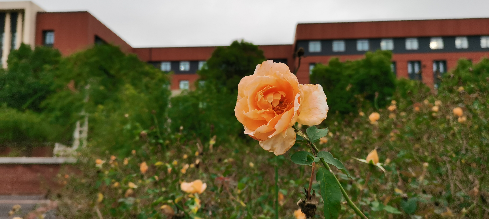

---

type: "post"
title: "Inutilia"
author: "Horizon"
category: "Articles"
date: "2023-11-03"
slug: "/Article_12"
postImage: "./img/Article_12.jpg"
metaDescription: "抬头望向天空、一只乌鸫正孤寂地张开翅膀滑翔、时而，它又收紧双翅、以纺锤的形态自由下落一段距离。这是最自然的形态。"

---

&emsp;&emsp;[Inutilia](https://soundcloud.com/rushdownrecs/quartzone-l-m-inutilia)

&emsp;&emsp;闭上双眼、疲惫的我难得有机会松弛了紧绷的神经。躺在床上、枕边随着呼吸隐约起伏的光晕温暖着我的心扉。放空思想、美好的思绪随意地铺在空间里的每一处。我畅想着、踏进了我心中的园林。

&emsp;&emsp;万物生长，春意渐浓。跨过墨绿色的石阶，一幅江南水墨画映入眼帘。乌墨的檐与粉白的墙是这里最纯净的印记。行道旁，透过细密的竹林，涧流与岸石碰撞的清脆声传入耳中，伴随着晨间芳草与泥土的清香，我重获新生。不远处，一座孤傲的石亭定在岸边，亭的棱角在清凉的微风中显得尖锐、却又在温暖的阳光下磨得圆缓，仿佛随着时间流逝，正演进成不同的形态。凝神、睁开惺忪的眼，石亭注视着我，注视着溪涧上自由游弋的黑天鹅，也注视着这里的一切。墙上、稀疏点缀的斑驳、是从枝芽间洒下的阳光；墙边、绕花飞舞的蝴蝶、如同绵绵落下的春雨。

&emsp;&emsp;漫步在这一片恬静中，很适合随性地伸伸懒腰，回归最本真的自我。在精巧玲珑的石桥上，蹲下来透过石栏的缝隙，河道中成片的荷叶下是另一个世界：清澈的水体宛如无垠的宇宙、斑斓的鱼儿环绕着群星随处漫游，昏暗的阴影下，激荡出的水花就好似天空中的流星一般划过。抬头望向天空、一只乌鸫正孤寂地张开翅膀滑翔、时而，它又收紧双翅、以纺锤的形态自由下落一段距离。这是最自然的形态。

&emsp;&emsp;蛙声起迭，夏蝉嗡鸣。跨过石桥、是一座宋时的露台，阑干上篆刻着由岁月书写的伤痕。这里曾经热闹非凡、人声鼎沸、现如今、沧海桑田、空无一人。我尽力地想从脑海中整理出些许记忆，终于、好像又重新回到了那个夜晚。“朝飞暮卷，云霞翠轩；雨丝风片，烟波画船。”天空倾泻着大雨、我挤在熙熙攘攘的人群中、浑身湿漉漉的。然而、所有人的目光都聚焦在露台的中央。“原来姹紫嫣红开遍，似这般都付与断井颓垣。”高歌荡漾、琴瑟婉转。他不顾天色已暗，唱出了最动人的旋律；她不顾雨水侵袭、挥舞着洁白的衣袖。“良辰美景奈何天，赏心乐事谁家院?”苍白的月光下、撕裂、无力、沉没；蛙声和蝉鸣中、单调、重复、死寂。我尽力地想拾起这些碎片、可惜、依旧、残缺。琴声随着月光飘散、露台旁的人渐渐地从我四周消失、隐去。我不再感到拥挤、却仍始终盯着露台中央。交融、碰撞、死亡。慢慢地、慢慢地、我的眼前只剩下两只在黑暗中闪烁的萤火虫、它们最终淹没在了我的回忆里。露台，空无一人。

&emsp;&emsp;枝叶飘散、秋风阵阵。虽已入秋、午后的空气依旧炎热。飘弋的白云好似一连串的棉花糖，我和它好像马上都要化掉了…四周欢声四起、是朋友们赴约而来，可谓是“群贤毕至、少长咸集”。我们“引以为流觞曲水、列坐其次”、清酒入喉、脸上泛起了红晕，可是这却实实在在的让我们感到凉爽了许多。我们分享着近况、诉说着理想、抛开了生活的烦恼、共度在这一片只属于我们的桃花源里。身边的蔷薇依旧盛开、心中所向往的早已不止于此。我们围坐在涧溪旁的石阶上、看着猎犬在林中疾驰、望着雄鹰在天际中翱翔：冲破社会的传统桎梏、海洋是我们即将踏上的旅途、雪山是我们即将征服的险阻；不受他人眼光的制约、金黄色的向日葵海里埋下了我们最有生命力和希望的种子。宴席终了、宾客散去，枯叶被秋风从残枝上无情吹落，我却又望向了蓝天，发自内心地微笑了笑。
	
&emsp;&emsp;银装素裹、寒冬已至。独自一人坐在石亭里、再沏上一壶天目山绿茶、香气扑鼻。当略带苦涩的茶水入喉、心中回味的却是可口的甘甜，这种闲适的状态、让我在这场冬雪里倍感温暖与惬意。从家里带来了一根尘封已久的鱼竿、想模仿“独钓寒江雪”的高深与超脱、可是、却忘了自己并不会垂钓、只能傻看着鱼竿苦笑着。身边的所有东西都是白茫茫的、朦朦胧胧的。还好、也带来了一把尘封已久的胡琴，这的确是我擅长的。我二话不说、奏响了心心念念的“三门峡畅想曲”。乐音与落雪交融、时间在这一刹那间停止、所有的故事在这个瞬间交汇在了同一点上。我喜欢这样远离尘间的感觉。

&emsp;&emsp;不知不觉间、已经凌晨三点了。但我不是很累、我很开心。看了眼桌上的“小森林”，我想、也许只要我心中始终饱含着对生活的信念，那么我的身边一直都能溢满着自然的美好。
