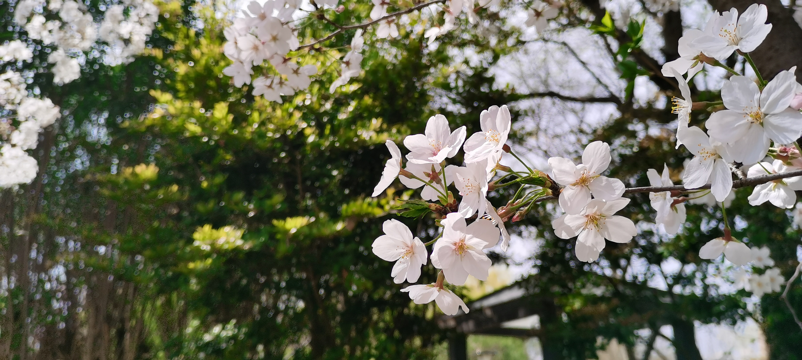
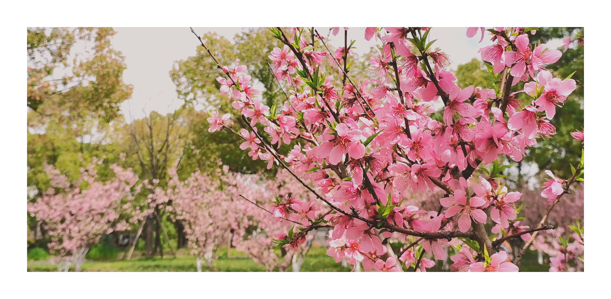
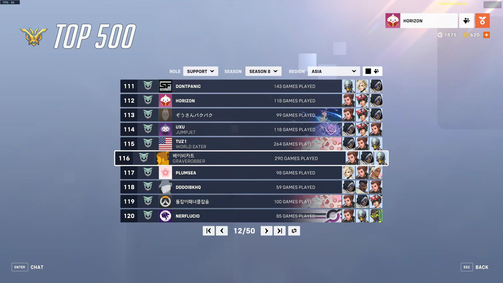

---

type: "post"
title: "Memories"
author: "Horizon"
category: "Articles"
date: "2024-04-06"
slug: "/Article_13"
postImage: "./img/Article_13_1.jpg"
metaDescription: "“经常会遐想，如果没有毛加是不是能有机会更进一步，但事实已经摆在面前了；人生中失败才是主旋律，如何面对失败，才把人区分成了不同的样子。” ---source"

---

&emsp;&emsp;掐指一算，大抵是有七个月没有动笔写东西了。原因也许是最近忙完了很多拖了很久的事情，感到一身轻松；亦或许是和喜欢的人面对面，久违地交换了彼此的意见。不论如何，我感到我的生活即将进入一个新的投身于学习的阶段。所以，这也该是时候总结记录一下，在过去这些日子里发生的事情吧。

&emsp;&emsp;转专业的事情告一段落，第一件事情就是和失散多年（不是）的小学同学一起约了个饭，分享了各自的看法，在学校里自在地兜兜转转了一会。其实大一上分专业的时候就知道这位同学也在软工，不过好久没联系了，当时也不是一个专业，因此大家也就都心照不宣地没有找对方攀谈。不过现在大家又重新在一个班级里了，也算是机缘巧合，不得不让我感慨世界真小。当然，也又请了先前帮助过我的两位学长和三位室友吃饭，自己也免不了挑了些好的店聚餐，来来去去确实破费不少，不过确实又促进了很多感情。

&emsp;&emsp;再后来，这段时间几乎就都是和ow有关了，这倒也不是内心有什么执念所往。这段故事的缘起是在11月份的时候，kdlin又办了一次osu秋季赛，我那天当时还在健身房里锻炼，休息的时候看到tim里k宝给我发消息说：打不打osu，很需要我。其实我当时一开始不是很想打这个比赛，一方面其实准备继续好好潜心卷学习，另外自己当时的水平也不高，打的话也在团队里起不到很大作用，所以一直抱着如果有人找我组队打的话我才会考虑一下的心态。不过我收到消息没多久，稍微思考了一下就接受了。原因很简单，我当时觉得kotori很厉害，而且一直很喜欢和kotori一起玩，所以收到他的消息的时候感觉自己确实很被需要了，所以没多想就答应了。在同一时期，oldchen又办了一个全国性的cuol比赛，当时因为校队里前辈们都不打了，所以我才能一开始就坐稳main support的位置。从此，两场赛事同时打响。在[osu（点击查看）](https://play.toornament.com/en_US/tournaments/7234871554011725824/stages/7234884143971966976/groups/7234884145448362049/)里，我是team name的support player，队友有kotori，fduzhouchen，hcl10，everspring和sfang；在[cuol（点击查看）](https://challonge.com/zh_CN/3g94l41z)里，我们还有4员实力大将zbra，studoge，takuru和rua。

&emsp;&emsp;最先开始的是cuol的训练赛，因为我们队伍里5个人有3个包括我自己，之前都没有很多比赛经验，因此整个队伍从最开始建立起来其实磨合了很长一段时间。略微记得第一场训练赛，我当时只会玩kiriko，也不怎么说话，打起来的时候，整个队伍好像确实就像一盘散沙，大家都不知道要干什么，都在各玩各的。而我就算是打训练赛也很紧张，我之前的性格让我不敢多说什么，其实我也不知道应该说什么。到后来多打了几场训练赛了之后，整个队伍的磨合渐渐紧密，开始有人报集火，算技能什么的。不过我还是会有一点紧张，很多时候不知道该做什么，不知道该说什么，技能也经常算错，误导了队友......但是教练source又把核心的指挥任务交给了我，我那时候感觉自己好迷茫。

&emsp;&emsp;不过事情的转折发生在一次意外之中。有一个周末，我初生牛犊不怕虎般地在冬天洗了个冷水澡，结果2天之后就感冒发烧了。当时也正直流感季，我就去医院验了个血，好在是并没有病毒性侵扰。但是我那时为了图发烧快好（已经休息了2天还没好。。。），在医院临走前又不怕死地吊了2瓶布洛芬盐水。可是，最逆天的在于，当我吊完盐水之后向外面走出去的时候，逐渐感到眼前发黑，呼吸困难，真的很有垂死挣扎的感觉。我感到要快死掉了的时候第一件想到的事情就是我是不是不能再玩我心爱的kiriko了......后来还好当时还没走出病房，被旁边的医生和好心人搭救活了。我其实那天没吃东西，所以吊完盐水低血糖了，又没给我吊葡萄糖水。旁边的好心人喂了我几块巧克力和一只馒头，医生也告诫我下次不能再这样吊盐水之前不吃东西了。不过给我留下最深刻印象的还是临死前那一瞬间的感觉......我会一直记在心里。

&emsp;&emsp;也正是这天晚上，我因病缺席了这天的打安少队伍的训练赛。但此时一个关键人物出场了，队友拉来了南大的wzrygosu好兄弟来顶替我的位置，我那天晚上忍着病痛还是坚持作壁上观。不过这次观摩确确实实地让我学习到了很多。记得是在暴雪世界这张地图上，gosu就像团队的大脑一样，遥控着4个队友的行为：在a点防守的时候，一波指挥联动zbra把二楼的人吃掉的动作干净利索；在b点防守的时候，指挥队友要卡住二楼那个拐角不要放，最终将payload牢牢守在了b点；同时，gosu的算技能和交招的思路都很清晰，每一波都会根据当前双方阵容的情况，告诉团队这一波我们是该push还是slowly，我们应该配什么大招打这波，我们是该打先手还是接着打...很多很多。最后那天的训练赛力克劲敌，拿下了胜利。但是我看完这些之后感觉自己顿时茅塞顿开，恍然大悟了：原来是可以这样做，这样说的！

&emsp;&emsp;到了[CUOL（点击查看）](https://liquipedia.net/overwatch/CUOL/2023)的第一场正赛，我虽然还是有点战战兢兢，不过也开始尝试像gosu那么做了，开始更多地算技能，更多地指挥队友，更多地阅读局势，更多地做配招，更多地给队伍打气加油。好像原来封这我嘴巴的拉链被打开了，但可能更是敲开了我心里原本闭塞的那把锁。有惊无险地，我们拿下了我们队伍首秀的胜利。不过我这时候还是可怜兮兮地只会玩kiriko，所以我反思道，是不是我的英雄池太浅了。因此我把目光放到了当时版本强势的brig上，本来其实当时早在初中的时候，我也算是brig中高手了，不过好久没玩了，很害怕。

&emsp;&emsp;但是，我就是下定了决心，要认真对待这两次比赛。也许是因为之前将死之际的一瞬，更因为是我感觉这可能是我第一次，是最后一次，也是唯一一次，正好有比较宽裕的时间，加上有非常厉害的队友（zbra和takuru即将毕业），去冲击一个比较好的名次，不让之后的自己留下更多的遗憾了吧。因此，我开始近似于不顾一切地想办法精进我的思路和玩法。每次画完大力气做完数理方法等课程的作业之后，我就会去看各种pro gamer的第一视角，我最喜欢viol2t的kiriko，lengsa的brig，一边看的时候我还会一边去想：这个动作为什么他会这么做，为什么他要这么做；这个时机我会怎么做，但其实更应该怎么做；这个英雄的思路是怎么样的，是抽后排还是卡拐角；这个技能为什么要这么放......种种。再加之有队伍里的brig天才zhouchen帮我复盘，鼓励我多勇敢地往前站，和t站在一条线上后，我更是顿悟了。

&emsp;&emsp;在练习solo rank的过程中，一开始有经历连败的阵痛，不过一旦你学习了高手，模仿对了对象之后，剩下的就交给时间和经验的积累了。前前后后在一个赛季里，我用60fps和240fps的屏幕交替打了至少500把rank，最终总结出来了一套属于我的游戏理解和逻辑，在根据面对不同阵容搭配和选择，主要灵活使用brig，kiriko，mercy，baptiste，moria，zenyata这几个英雄之后，我从一名路都走不明白的大师萌新，一路打到了四号宗一，双号留榜的实力，最高也打到了asian server 112th 的名次。在osu里，队伍里的大哥们带着我夺得了冠军（无敌毛妹，有框麦克雷，外挂小美，天才巴蒂，笨笨天使！），我也没犯很大错误，还算比我开始的时候想象得更有用一点了。我好开心。

&emsp;&emsp;在cuol这边，我们也是过关斩将。

&emsp;&emsp;但是最终的结果还是能令人接受的吧。其实最终比赛的名次多少，在许多年之后也并不关键了，真正关键的是我们整个队伍形成了一个牢固的整体，这是弥足珍贵的！同样值得我去回味的，还有我自己的成长。就借用source在[nga的一篇帖子（点击查看）](https://ngabbs.com/read.php?tid=38865894)里说的那样吧：

&emsp;&emsp;“horizon是这次进步最大的选手，在这次赛事中从0开始苦练小锤最后到现在双号宗1，每次训练赛都会主动思考各种各样的问题，去请教玩小锤的高手精进自己的操作；与此同时，相比开始时候默默输出的雾子，horizon在赛事后期已经有了一定指挥能力，进步有目共睹。”

&emsp;&emsp;记录一下由教练团队联手编写的43页的赛训总结：

&emsp;&emsp;[kk杯 - 赛训总结.pdf](https://github.com/Horizon12275/Horizon.kyz/blob/main/content/pdf/KK%E6%9D%AF%20-%20%E8%B5%9B%E8%AE%AD%E6%80%BB%E7%BB%93.pdf)

&emsp;&emsp;顺便记录一下所有出场过的录像留作纪念：

&emsp;&emsp;[上海交通大学 vs 深圳技术大学【CUOL第一轮0-0组】](https://www.bilibili.com/video/BV19b4y1T7G3/?spm_id_from=333.999.0.0&vd_source=23710c36ec67fcb89d3077992fb7fcf7)

&emsp;&emsp;[上海交通大学 vs 华中科技大学【CUOL第三轮2-0组】](https://www.bilibili.com/video/BV1nN41157Ez/?spm_id_from=333.999.0.0&vd_source=23710c36ec67fcb89d3077992fb7fcf7)

&emsp;&emsp;[上海交通大学 vs 浙江传媒学院【CUOL第四轮3-0组】](https://www.bilibili.com/video/BV13N411V7tj/?spm_id_from=333.999.0.0&vd_source=23710c36ec67fcb89d3077992fb7fcf7)

&emsp;&emsp;[上海交通大学 vs 东华大学【CUOL第五轮4-0组】 ](https://www.bilibili.com/video/BV1Xg4y1r7cA/?vd_source=23710c36ec67fcb89d3077992fb7fcf7)

&emsp;&emsp;[上海交通大学 vs 华中科技大学【CUOL八进四】](https://www.bilibili.com/video/BV1JC4y1i77k/?spm_id_from=333.999.0.0&vd_source=23710c36ec67fcb89d3077992fb7fcf7)

&emsp;&emsp;[上海交通大学 vs 江西科技学院【CUOL半决赛】](https://www.bilibili.com/video/BV1Kg4y1r7N3/?spm_id_from=333.999.0.0&vd_source=23710c36ec67fcb89d3077992fb7fcf7)

&emsp;&emsp;[上海交通大学 vs 中国民用航空飞行学院【CUOL季军赛】](https://www.bilibili.com/video/BV1PT4y1W7aD/?spm_id_from=333.999.0.0&vd_source=23710c36ec67fcb89d3077992fb7fcf7)

&emsp;&emsp;[【比赛录像】2023OSU联赛·自由组队赛第二轮 武汉理工大学宝宝巴士 VS team name](https://www.bilibili.com/video/BV1mu4y1L77Y/?spm_id_from=333.999.0.0&vd_source=23710c36ec67fcb89d3077992fb7fcf7)

&emsp;&emsp;[【比赛录像】2023OSU联赛·自由组队赛第六轮 Team Name VS DDC Gaming](https://www.bilibili.com/video/BV19a4y1o7Up/?spm_id_from=333.999.0.0&vd_source=23710c36ec67fcb89d3077992fb7fcf7)

&emsp;&emsp;[【比赛录像】2023OSU联赛·自由组队赛季后赛 8进4 team name VS 快用你无敌的蓝拳想想办法](https://www.bilibili.com/video/BV1jj411s7Ww/?spm_id_from=333.999.0.0&vd_source=23710c36ec67fcb89d3077992fb7fcf7)

&emsp;&emsp;[【比赛录像】 4强赛第一轮 team name VS 夕阳红(犯规)·2023OSU联赛·自由组队赛季后赛](https://www.bilibili.com/video/BV1oC4y1X7kr/?spm_id_from=333.999.0.0&vd_source=23710c36ec67fcb89d3077992fb7fcf7)

&emsp;&emsp;[【比赛录像】Team Name VS 上海建桥学院 胜者组决赛——2023OSU联赛·自由组队赛季后赛](https://www.bilibili.com/video/BV1He411k7jq/?spm_id_from=333.999.0.0&vd_source=23710c36ec67fcb89d3077992fb7fcf7)

&emsp;&emsp;[【比赛录像】Team Name VS 上海建桥学院 总决赛——2023OSU联赛·自由组队赛季后赛](https://www.bilibili.com/video/BV1Rj411n7GL/?spm_id_from=333.999.0.0&vd_source=23710c36ec67fcb89d3077992fb7fcf7)

&emsp;&emsp;最后在此也记录一下许多在学校里陪伴过我度过tough time的兄弟们吧，不分先后，不分字数多少，感谢大家！这样做，也是免得以后事情太多忘记了TT（不是故意的）：

&emsp;&emsp;gjw陪我一起跑步，锻炼，谈心，还帮我做了电子技术实验的模电部分！

&emsp;&emsp;ycft和我一起上体育课，聊学习规划，很厉害的一个人，还送了我一个纪念品！

&emsp;&emsp;cly老上海人了，带我过了排球考试，聊过很多事情，很好的一个兄弟！

&emsp;&emsp;szy学长从我进学校就开始带着我，让我更快地了解了这个学校的真面目，太棒了！后来又送了我很多学习资料（包括模电，虽然没学），又带我去锻炼身体！

&emsp;&emsp;sbz和我一起锻炼身体，现在也要继续加练，比我厉害！

&emsp;&emsp;zbra，takuru，studoge，rua，horizon我们五个才是实至名归的CUOL冠军！也很享受和各位一起rank，training，quickgame的时光（不过我感觉我duo的时候都在当演子，分都是单排上的hh）

&emsp;&emsp;qxs虽然没在cuol里起多大作用（虽然写了很多观赛记录，但是不如最后一句jxtu的法鸡阵容没有强度，我记得我打比赛前是看到的TT），但是也是从大一我一进来就开始带着我更快了解了学校，我记得有好多次我也找他谈心，疏导心事的，最近也经常一起吃饭，一起跑步的！

&emsp;&emsp;source，ubf，etonl在比赛期间也做出了卓越贡献，帮助我提升了很多，每次复盘前两位也都在。source让我知道了GAMES101这个课，也让我多刷leetcode，很不错。ubf告诉了我很多在读研读博的时候即将面临的事情，让我开拓了眼界，很辛苦的老学长。领队负责忙一些有关比赛的杂事，约训练赛也很负责任，我当时也多顺了一个SHD的奖品好像（。

&emsp;&emsp;echo姐姐人很好，打比赛的那天也在现场。后来一起吃饭也了解到了很多以后读博要面临的事情。我其实也和她倾诉过了很多心事的，现在想想那个晚上自己喝着酒说话好尴尬hh，不过自己当时确实很压抑，说完了会好一些的。

&emsp;&emsp;tisuki这个人有点搞的，不过我和他吃完饭，聊完天，带他逛完学校之后他还给我送了tju的纪念品，挺好的一个兄弟。

&emsp;&emsp;fduzhouchen，遊生夢死，hcl10，everspring四拖一带一个horizon是osu最厉害的team name！k宝那天邀请我打osu让我感觉自己被狠狠地需要了，很开心！zhouchen姐姐（不是）帮我复盘了小锤，让我能够在后来四号宗一，双号留榜。盐酸和nbd打比赛时是无敌的小美和巴蒂，一个总能打开局面，一个总能用维生立场保住可怜的我，太牛了！最后也拿到了uu年卡，血赚。

&emsp;&emsp;事后烟，千载，doeloz，21，kdlin，bubastis，starsoul，yakimiku，xbg，disap，cgg，jianxian，starlight，chikas，t3quila还有很多都是一起玩过的朋友！cwx的声音很sexy，印象最深的还是ubf生日那天带了一袋子水果来；千载的moria有进步，很好；dsz也是很好的兄弟，让我知道了很多efz的故事；21姐姐在我军训的时候就带我一起玩，带我进了校队；kdlin确实是ow真爱，牛的；zy给fdu直播复盘时候的声音也很好听，我经常挂着一边写作业；soul哥也带我去烘培社做过很好吃的饼干；disap很喜欢和我互动；cgg声音更好听！夸我蓝线给得好，还带我打了the finals；jianxian也是很有意思的一个人，给我讲过你的故事，满足你的要求也把你写进我的故事里了！

&emsp;&emsp;当然还有很多其他人和事，我再不写可能都要想不起来了..................

&emsp;&emsp;

&emsp;&emsp;未来会有更多我和你的故事嘛？

&emsp;&emsp;我好想为你写下更多。

&emsp;&emsp;

&emsp;&emsp;Yours

&emsp;&emsp;horizon

&emsp;&emsp;time span: 

&emsp;&emsp;2024.4.7 0:27-2:39

&emsp;&emsp;2024.4.8 0.57-2:29

&emsp;&emsp;2024.4.8 13.26-