---

type: "post"
title: "破茧成蝶"
author: "Horizon"
category: "Articles"
date: "2024-04-22"
slug: "/Article_14"
postImage: "./img/Article_14/直升机旁的麻雀.jpg"
metaDescription: "也许我也是其中一只麻雀，能永远在赛车场的天空中自由地飞翔。"

---

&emsp;&emsp;“也许我也是其中一只麻雀，能永远在赛车场的天空中自由地飞翔。”

停机坪旁的麻雀

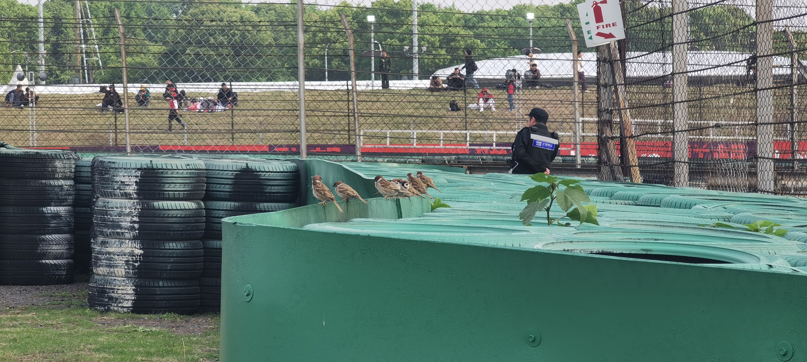

&emsp;&emsp;时间回到

Pierre Gasly Win at Monza

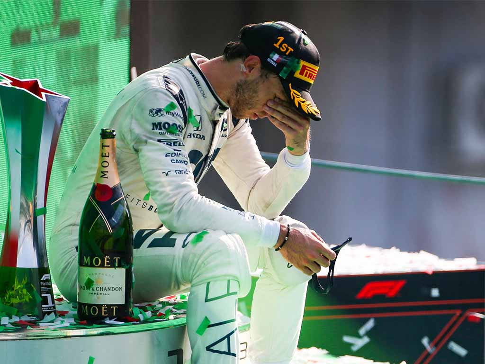

Charles太帅了

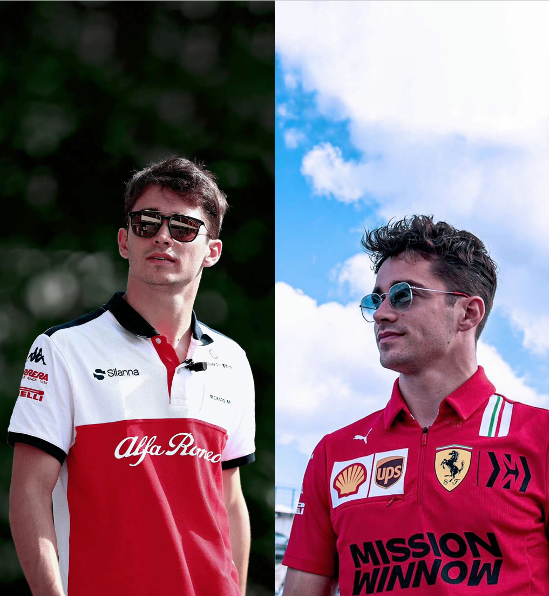

<video src="./img/Article_14/Charles_Leclerc.mp4"></video>

&emsp;&emsp;

一些回不去的记忆

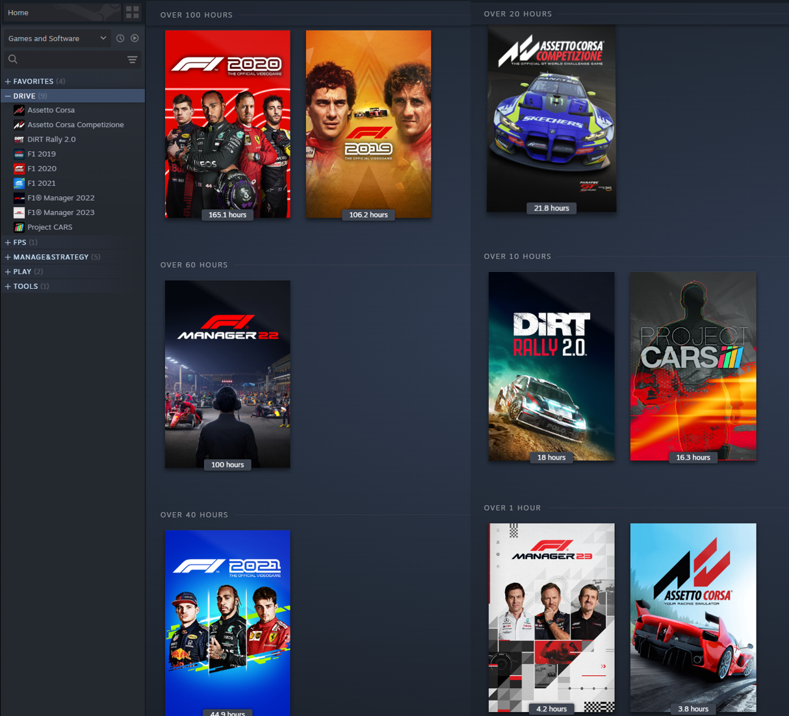

ThurstMaster T300

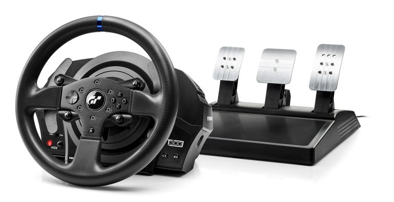

&emsp;&emsp;

发车直道全景 无人

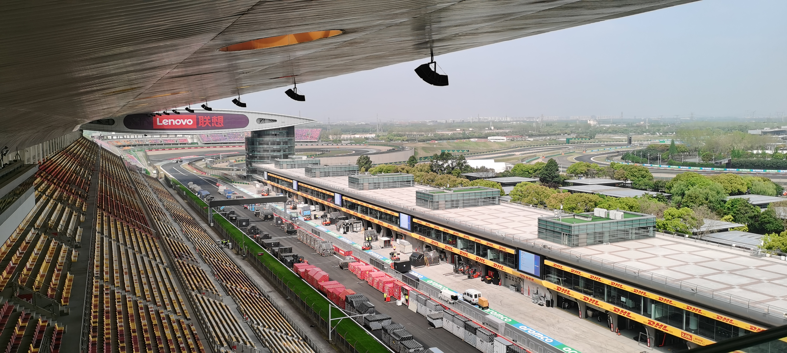

&emsp;&emsp;

周四晚上的月亮

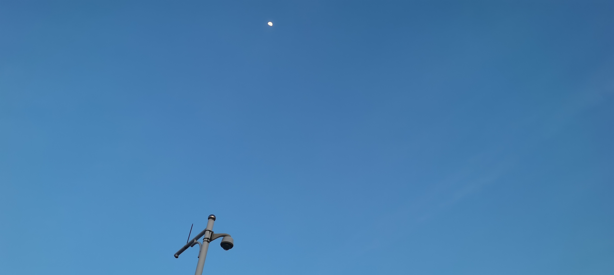

&emsp;&emsp;

赛前发车直道 在观众席

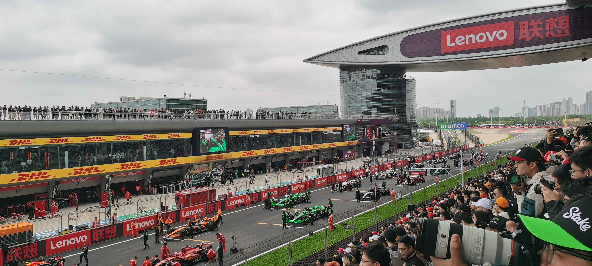

&emsp;&emsp;

直升飞机和看台

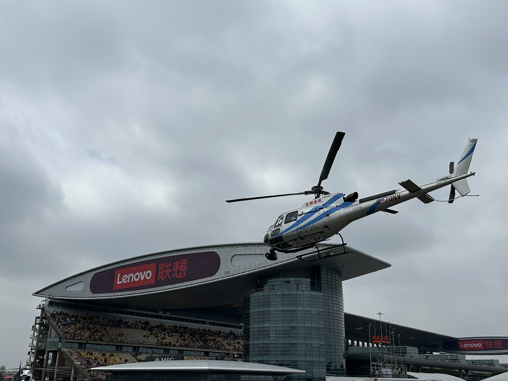

&emsp;&emsp;

机组人员合影

&emsp;&emsp;破茧，成蝶。

---

&emsp;&emsp;最后进行一个日程的流水账式的记录，记录了很多心理活动和细节，所以前面的文章也不想写得很长。写下来主要是以免自己以后忘记很多宝贵的细节。我只能说真的是一天比一天精彩，我到最后我都快幸福得不知道要说什么了。

### Day 1 (Mon)

- 造访了Media Center（充满大屏幕的房间，视角很好，可以看到发车直道和最后一弯）。

- 场外观众区正在搭建中（Heineken的星星什么的）。

- 工作区域是TV Compound（里的一个小房间），发了中方证，外方证。

- 星期一的时候还没有围场门禁，Paddock里面全是工地，正在搭建中，看到很多外国工作人员在开各种叉车和吊车拖车什么的。

- 中午去食堂吃饭的时候碰见了虾哥（潘湧湧），勇敢地向他去要了这个比赛周的众多合影中的第一张合影。

- 说实话，工作量并不是很大，主要负责在工作时间内一直在小房间里值班，但是老师也给了我一个翻译保密协议的工作，花费了我一小时左右的时间（我测我刚刚写的时候才发现，这个协议就是最后直升机航拍和F1官方的协议啊啊啊啊阿我测我测我测我测我测wtfwtf我有点受不了了）。

- 其余时间在上ICS和数学基础的网课，没有落下学习。

- 这一天其实我还是有点怕生，所以没敢到pit lane里去探险，而且当时那里还都是工地和叉车，所以我计划周三再去逛。

空的媒体中心

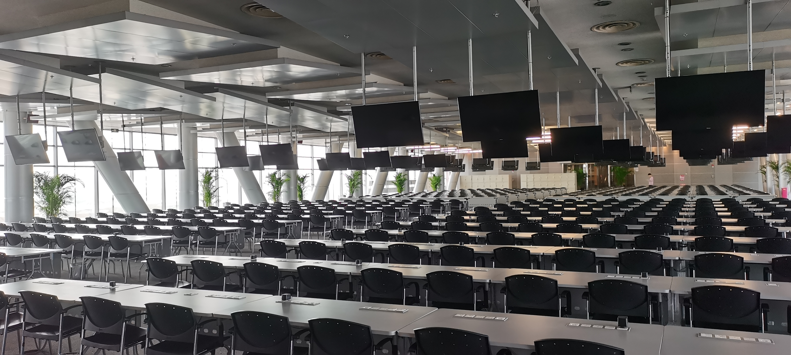

轮胎仓库

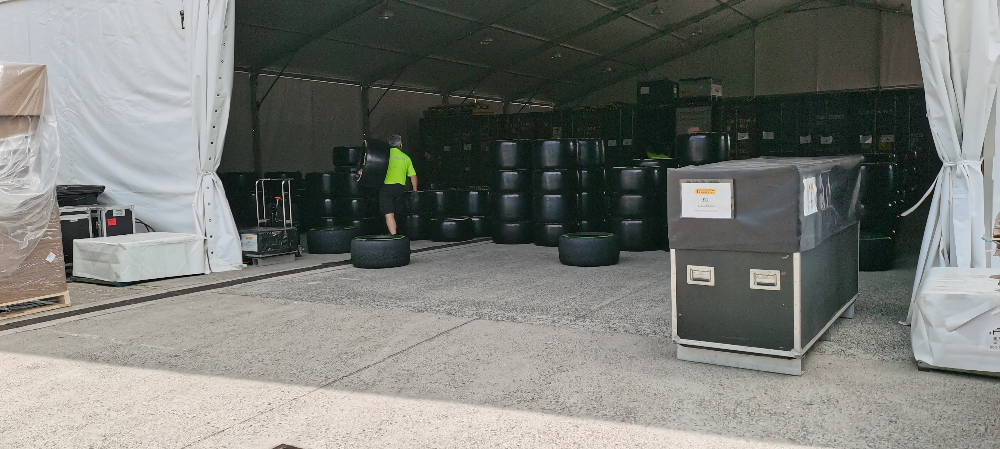

修建中的围场

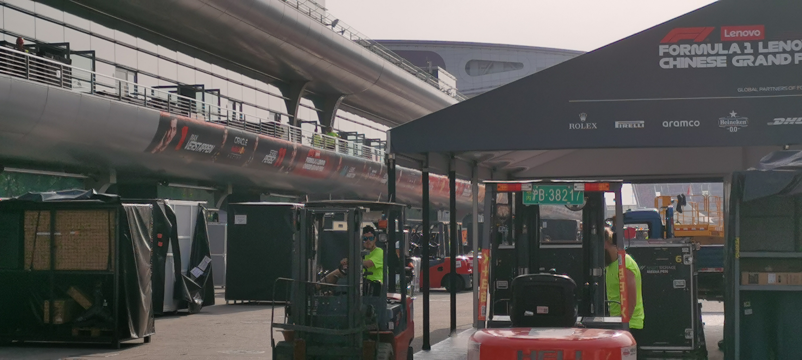

TV compound全景

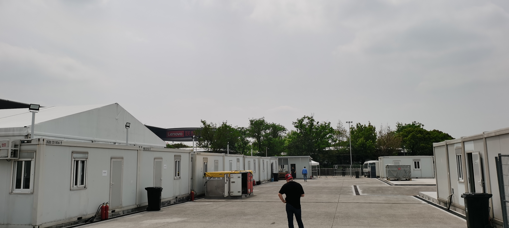

媒体中心看到最后一弯

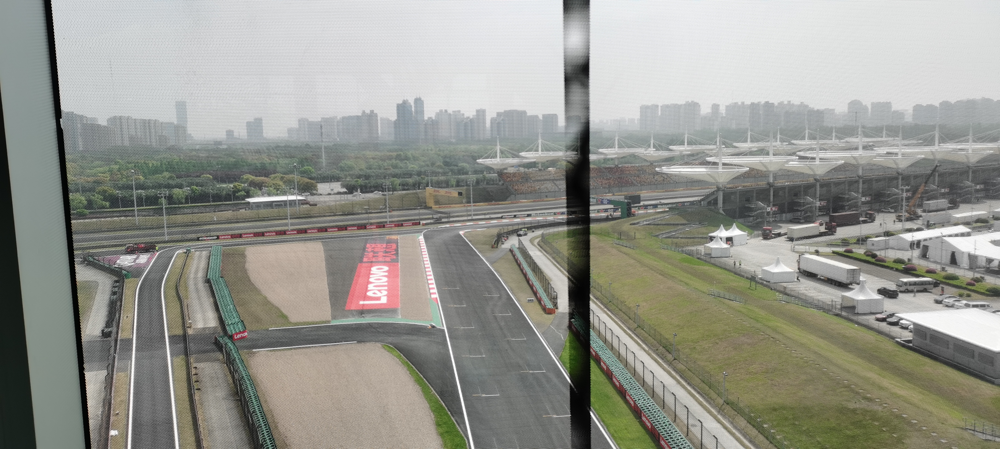

外方证

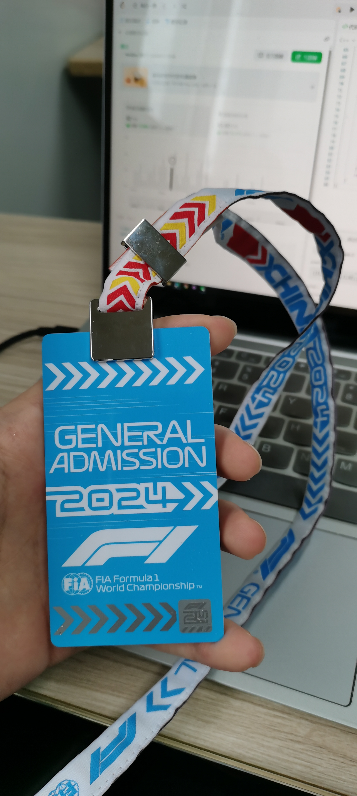

### Day 2 (Wed)

- 这天是坐班车到赛车场的，下了很大的雨，鞋子全湿了，湿了一天，很难受。

- 到了小房间之后TV compound里面到处在漏水，小房间在我的座位旁边的窗户也漏水了，不过后来找人来修好了。

- 周三早上还没有Paddock的门禁，我先行拍摄了一圈Pit Lane后方和生活区（别墅区），但是我这个Timing又给我抓住了，因为周三下午门禁就设置了，然后因为后面我的外方证权限不够，进不去。

- 这一天主要做了在小房间里值班，解决诸如Netflix房间漏水的问题，协调外方和中方保障人员进行对应的处理（值守TV compound的助理小屋，协调解决Netflix转播房间漏水的问题，协调解决中国电信信号车天线和电缆的问题，协调解决TV compound区域空调故障的问题）

- 晚上就直接回家了，累死了，回到家9点钟就睡着了，因此错过了喜欢的人的一个问题。（其实是因为感觉她不想理我所以小e了一晚上）

- 但是这一天其实我已经很满足了，能亲身拜访这些从前只能在电视转播中看到的区域，已经很满足了，我真的没想要更多。

雨中的paddock

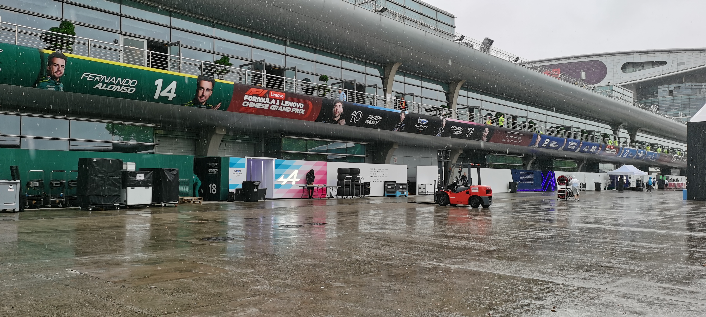

别墅区内部

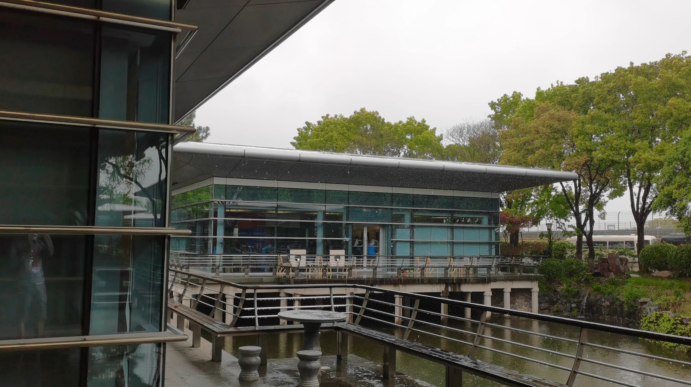

Netflix的房间

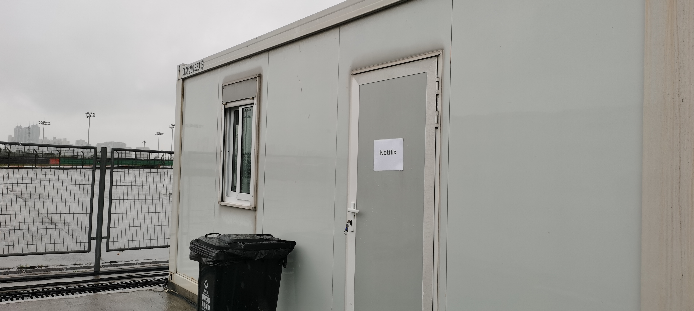

Netflix的房间漏水了

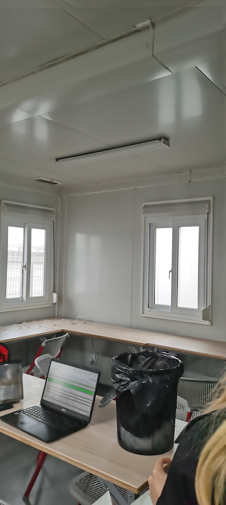

### Day 3 (Thu)

- 早上睡到4点半就起来了，继续复习周五的期中考试，还解决了昨天的的问题，在地铁上也在继续看。

- 早上7点钟坐的地铁，到的时候是8点45分。但是这时候小房间的门还没有开，我寻思了一下，因为pit lane有两个入口，而且我根据长期一来了解F1咨询的经验，车手在周四早上一般都会到达围场，因此我正好想到，我要不就到围场门口去蹲着吧。所以预料之中地，我先后看到了Daniel，Logan，Esteban，Russell和Zhou，其中，Esteban人特别好，也可能是我当时旁边站了两个小志愿者的原因，他一下车就跑过来和我们合影。我当时觉得真是太幸福了。不管是亲眼近距离地见到，亦或是能合到影。（不过一天比一天幸福）当Esteban和我合影的时候，我还和他说“I remember you win in Hungary! You are a grand prix winner!”他也很开心地对我笑着。真的很开心。

- 这天工作也并不算很多，除了值班外，其中有一件事情就是来修天线的工作人员的证不能刷进TV Compound区域的安检，因此花费了一些时间和保安沟通，不过最后还是放外方证权限不够的工作人员进来了。

- 这天中午在去吃饭回来的路上，也看到了Safety Car在Refueling，在Safety Car穿过隧道的时候，拍了一段很酷的视频。

- 下午在空闲的时间里，还是在复习期中考试，一直看一直看，做完了好多题目，不过最后回到寝室里的时候，pipeline的题目还没看完，所以一直复习到了24点。

- 周四下午临行前，还闲适地和同时兜了一圈已经快要搭建完的围场外的观众活动区，相当于提前一天参观了，工作人员还邀请我上了场外的模拟器提前试玩，在F1 2023中跑了一圈上赛。不过我好久没开模拟器了，手有点生，那个方向盘也没调成180度（半圈），所以手感很不好。不过这种vip的工作人员的感觉有点爽的。

- 这一天我感觉我能要到Esteban的合照已经无敌传奇了，没想到更加传奇的还在后面几天。

Daniel入场

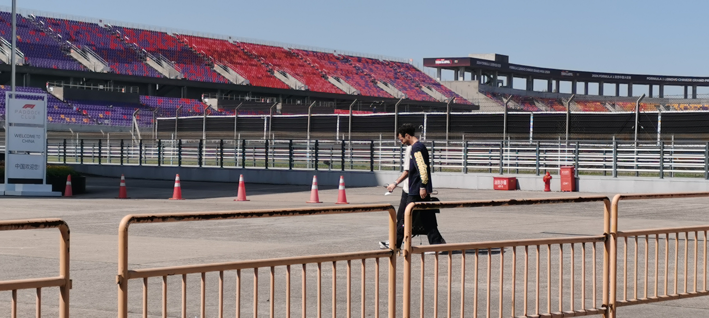

Logan入场

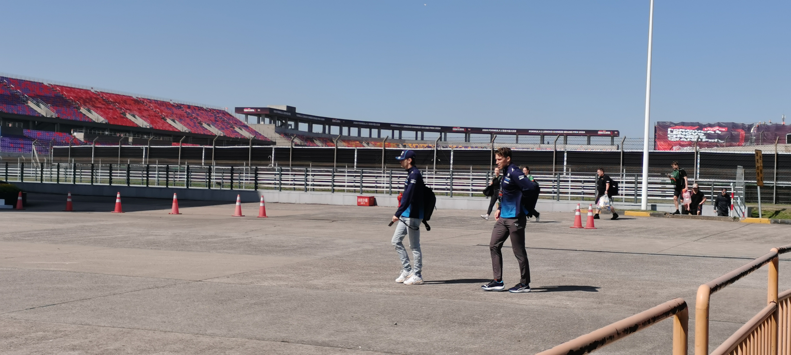

Russell和Zhou入场

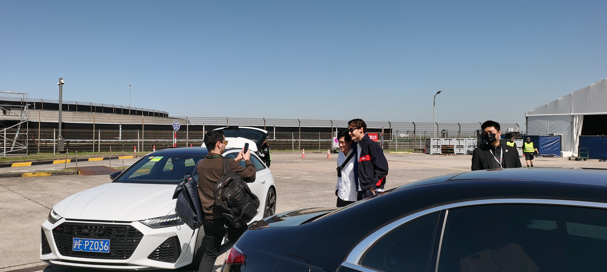

瓦塞尔入场

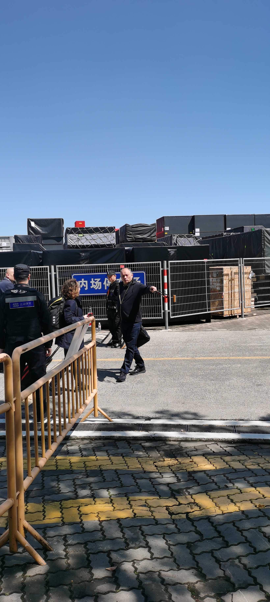

在加油站加油的安全车

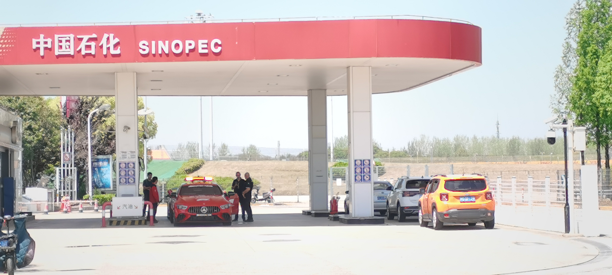

### Day 4 (Sat)

- 周五考完试，早上答辩完之后一身轻松。中午去帮CCTV的家伙们领盒饭，等死我了，同时只能在主看台下面的工作区，不能上看台看比赛，所以我就用手机看完了冲刺赛（整个周末我唯一有机会好好欣赏的一段Session，因为后面上飞机了其实都没关心比赛情况）。不过这里又抓了一个Timing，乘着冲刺赛刚刚结束，人还比较少的时候，我到外面中间的官方商店里抢先买了几件，后面出来的时候，都排起长队了。

- 入场的时候，走的是工作人员通道，又感到一种无敌的vip的感觉，虽然我不是vip，但是很快地就穿过了安检和道口，感觉也已经无敌了。

- 前戏做完了，高潮要来了。在我结束早上的工作，回到小房间里的时候，老师突然告诉我要求我下午要上直升飞机去给Pilot和Camera Man做翻译。原因是一位老师恐高，一位老师不敢上去，还有一位学姐晕车。同时，这个翻译工作还要求对F1和赛车运动有足够的了解，因为拍摄的就是地上的赛车，所以会有很多拍摄赛车时与赛车运动规则相关的要求，比如在Formation Lap，Safety Car和Racing状态下赛车分别是如何行驶的，亦或者Free Practice，Qualifying，Sprint Race和Feature Race的赛程下赛车究竟会做些什么。坐在直升飞机上时，我也是总能准确地翻译和表达出双方的交流需求，比如Flat Fly，Bank Angle，Nose up等等直升飞机的动作。

- 所以我感觉我这个工作只能说是舍我其谁了。老师和我一同讨论出，又要会英语，又要会中文，而且懂赛车，而且能随便被差使，那只能是我这个人了。（再加上后来发现，先前我翻译的保密协议就是这场直升机航拍的保密协议，也许我就是一定会上这个Heli）

- 其实第一次上飞机之前我还是很害怕的，我当时把这件事第一时间告诉了两个人，希望寻求一点点安抚。当时其实也会紧张，主要是不清楚我到底要翻译什么，而且怕会不会听不懂（不过后来都听懂了，很简单，老外是比利时人，而且我最后感觉其实用中文表达比用英文表达更困难TT），而且这个直升飞机的动作会说是很猛烈（拍摄要求）。

- 飞机上很晃，而且随时会做很多猛烈的动作（可以参考我发的视频，应该有2份视频是记录这个直升飞机飞行的逻辑的）。晕机的感觉是一点一点积累起来的，其实一开始还好，但是慢慢积累到了一定的阈值之后，应该第一次差不多是1小时15分钟之后，我就不行了，在飞机上吐了，然后老外把我放下来了，那时应该还有最后一段q3没有拍摄完。（其实80%到90%的人第一次坐这样子飞的Heli都会很难受，我已经很厉害了）

- 不过下机之后，我缓了一缓。我整个人都不知道我刚刚经历了什么，何况是在Heli上看了排位赛，还看到Sainz的赛车在最后一弯里撞车了。下了飞机之后，我站在停机坪上，拍到了在停机坪一旁自由飞翔的麻雀，我感觉这是我这个周末艺术性最高的一幅画面。当时内心中只充满了对世界和生活的喜爱。甚至...当时其实已经激动到无法用任何言语来形容了。甚至是有冲动想好好爱她。不过还是收敛了。

- 排位赛结束，下班之后，我又极其敏锐地感觉到从TV compound和pit lane交界的入口处，会有三大车队的知名人物经过这里下班。（因为梅奔，法拉利，红牛三家的p房里这里的出口最近）果不其然，等待了约摸1个小时的过程中，先后蹲到了Checo，Horner，Russell，Hamilton，并要到了前三者的合照和签名，不过老汉好像是因为当天排位赛只有第18名，所以心情不太好，叫了他的贴身保镖保护他，不让蹲在内场的粉丝合照签名。

- 周六晚上和zyf去吃了一顿日料，他居然还点了一份辣子鸡？？？然后套餐里居然还有薯条，不过没吃完最后打包带回酒店了，送了他一件Russell亲签的梅奔队服，最后和他共度良宵。也录了第一段讲在直升飞机上的视频。

Horner和Checo亲签的Pierre的帽子

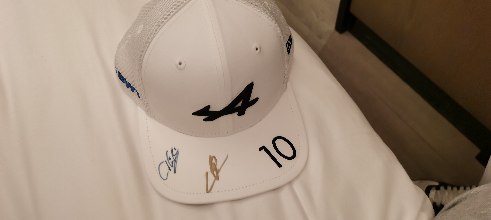

Russell亲签的梅奔队服

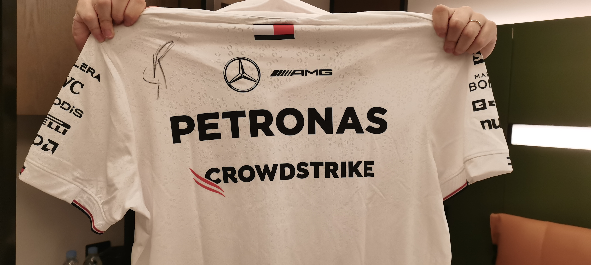

### Day 5 (Sun)

- 进直升机坪时，我的外方证其实权限不够（其实可以升级权限，但是升级的流程很麻烦，也到最后一天了，所以没有升级成绿色外方证（paddock），我的蓝色外方证是（general）只能进内场，但不能进paddock），所以需要有绿色外方证的人带我进去，不过每次过安检的时候都要和保安说明，有几个保安态度挺好的，我问他站一天多少钱，他说他们穿西服的一天300，然后那些穿保安服的一天240，还说来了30多家保安公司，只有他这个保安公司是正规的，虽然他们是因为人手不够从其他地方调过来的，但是他还说其他保安公司都是酒囊饭袋，哈哈。所以最后一次正赛起飞前我过安检，那个保安硬是要拦着我不让我进去，我直接和他歇斯底里地大吼道“叫你领导来！你大还是我大？”。然后大摇大摆地走进去了。太帅。

- 有一次过安检还在通往直升机坪的医疗中心随机拉了一个穿着赛车服的上海老爷叔帮我过安检。熟练地和他用上海话进行交流又让我感受到了学会这门语言的重要性。包括工作的老师和很多赛车场的工作人员，医务人员，全是地道上海人呀，感觉我一说上海话就能变得和他们马上很熟似的。

- 相反，CCTV的北京爷，这纯正的首都口音充满了傲慢，我和同事一致认为，就算北京爷和我说“谢谢”，我们都会感觉她在嘲讽我们。

- 值得注意的是，我周六周日两天都忘记写leetcode了，因为真的需要我完全专注于这个手头的Heli工作，其他什么事情都很难有精力去完成。

- 还好我把买的衣服和书包都放到zyf的爱车上了，所以我那天轻装上阵，除了一部手机啥也没带，一身轻松。

- 飞行前，又向飞行员咨询改进了一下我在飞机上的姿势和准备，以便我坚持下来。说是应该飞行前尽量不要空着肚子，所以我也把早上全家的两个饭团吃完了。而且说是要看着窗外，而不是看着飞机里的屏幕，会减缓晕晕的感觉。当飞机前倾的时候，要身体向后靠，这样的姿势会更舒服一点。

- 一位老师给我带了日本原产的王牌晕车药，所以我那天下午正赛的时候也特别持久，3个小时轻轻松松不在话下。而且我也不是第一次坐了，已经体悟出一些舒服的技巧和姿势了。

- 不过在飞机上时，其实没有好好看正赛，其实在飞机上的时候我基本没法清楚地知道比赛发生了什么，我大部分时间为了维持心态平稳，一直看着我左手边的窗户外面的远方，而且还要翻译和专注，所以基本没有精力看赛道上的比赛。。。不过有很多瞬间，从天空中的第一人称视角，真的会不一样。比如在1，2，3号弯里赛车的缠斗，地面上各种颜色的赛车在弯道直道上的拼杀......我至死都会记得。

- 飞机上的飞行员，飞行员教练和摄影师对我都很好，一直在鼓励我继续坚持下去，最后他们也很满意我的翻译的工作，我也和他们都要了微信。谁知道我下一次起飞是什么时候呢。伟大的直升机指挥牢大！

- 现在感觉这件从随便进出围场，到参观pit lane，生活区，在TV compound里工作，在Heli上面做完了共计5个小时的翻译（包括）......这些事情不过是很稀松平常的事情啊，确实对于我来说有点过于简单了。不过我还是没搞清楚为什么会发生这一切，原来其实很多事情早已命中注定啊。如果我当时不开始看F1，如果兄弟当时不告诉我有这个志愿者，如果我不是那么地喜欢她......

- 其实到最后正赛结束后，在围场里，要签名要合照已经是太过于轻松的事情了，不过我当时没带签名的笔和物件衣服等，所以签名也没有多要，其实我最后也只有周六签的三个名。只是和我喜欢的几个车手和领队兴奋地要了合照留念。有Nico，Toto和Charles。最后一个我特意蹲在法拉利p房门口，硬蹲了十几分钟，才乘着他身旁没人的时候，要到了我这个周末最满意最让我开心的一张合照。真的圆满了。虽然我的自拍技术不是很好。不过当我虽然身穿梅奔队服，但是给Charles展示我的手机壁纸上是他时，亲耳听到他说“Sure!”。真的圆满了。所以我就没有更多念想地离开了赛车场。Charles也总是能给我带来好运和希望。

- 当zyf把我上Heli这件事和他在VIP包厢的富哥同学说时，富哥的第一句话是“能买到么？”。是啊，能买到么。

- 晚上和zyf去吃了老太太烤肉，其实那时候已经很累很累了，大家也都快说不出什么话了。不过最后也体验了一下他那辆运动模式的BMW Z4，浅浅试驾了一下，有点爽的，方向盘握起来也很舒服。就是晚上东西吃得太多了，所以最后坐他车的时候让他开慢点，感觉坐这个开得快的车比坐直升机上还难受。

合照墙

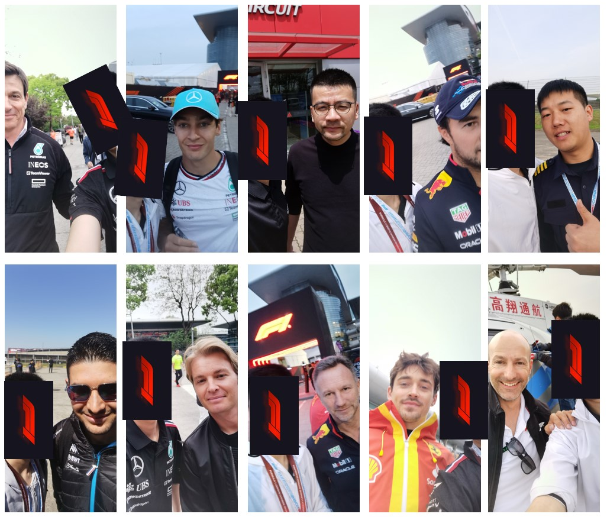

一直能给我带来好运的手机壁纸

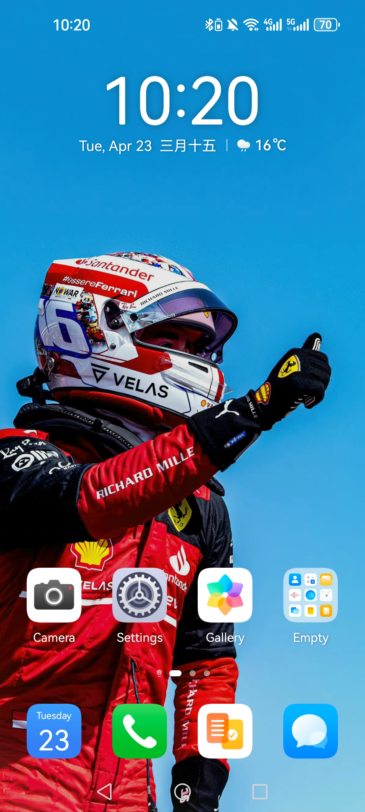

谁能想到呢？

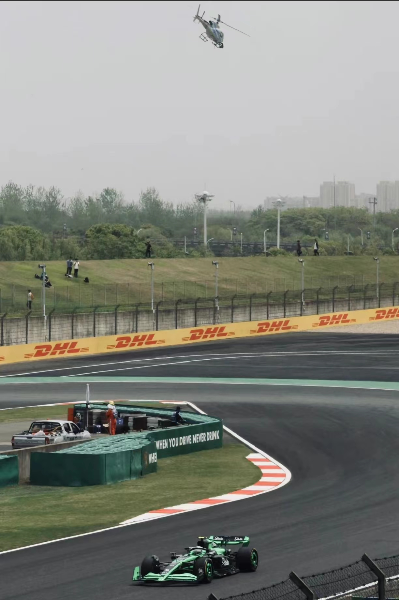

感谢你一直看到这里！

The End
