---

type: "post"
title: "Evaporate"
author: "HORIZON"
category: "Articles"
date: "2024-07-11"
slug: "/Article_15"
postImage: "./img/Article_15.png"
metaDescription: "腥气的狂风将雨水洒满了全身、再也没什么值得眷恋。"

---

&emsp;&emsp;***腥气的狂风将雨水洒满了全身、再也没什么值得眷恋。***

## Somnium Blog Web

https://github.com/Horizon12275/Somnium

### 使用方法

### CloudFlare

- 会有一个重定向次数过多的问题、只需要去 ssl 控制台里设置成完全就可以了（默认是灵活）

### Contentful

- 注意：这里初始化的时候、需要设置为一个新的空的 contentful space，然后需要在本地先运行一下 npm run setup 配置 contentful 对应的 gatsby 的 content 文件，这时候在 contentful 上面就会有对应的 blog 的内容模板了，默认会自动生成三个文档 blog post，一个人物 person。然后里面的第二个 token 不是 delivery token、是 cma 的 token，需要自己再去申请然后保存一下。

- 首先、点击这里的 apikey 选项、到了下面这个页面、新建一个 apikey、然后保存记录下面的 space id 和 delivery access id

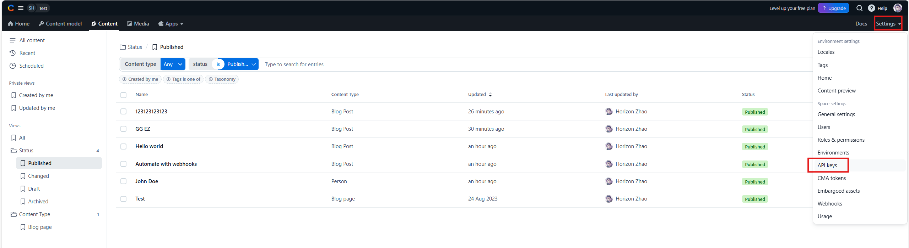

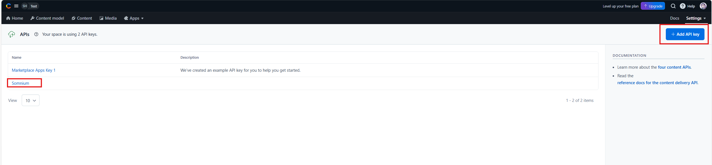

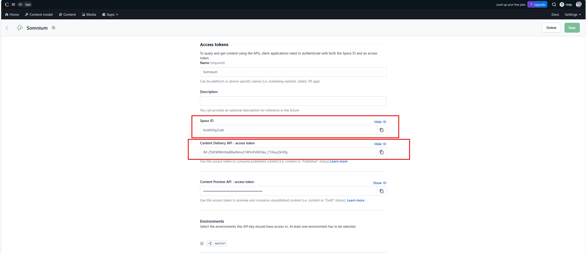

- 如何编辑 Blog：点击这里面的任意一条、然后会跳转到对应的页面、然后编辑完记得在右上角的绿色按钮点 publish（重要）

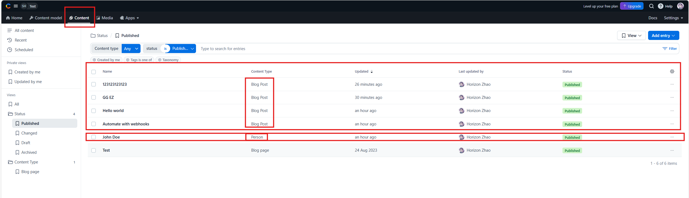

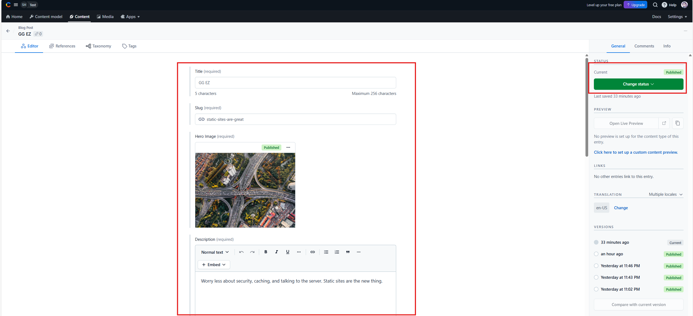

- 如何新建 blog、这里点 blogpost 新建一个 blog、其他两个目前没什么用、然后如果要修改首页的页面名称的话、可以修改 Person 这里这一条

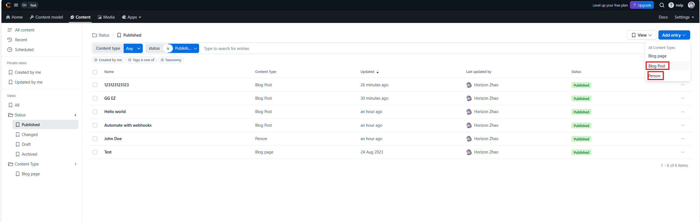

### Vercel

- 这里是关联到 github repo 的过程、具体自动部署的设置和需要设置两个环境变量的流程、放在这里备用记录

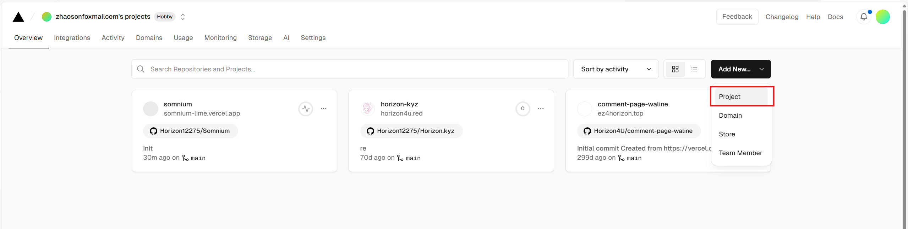

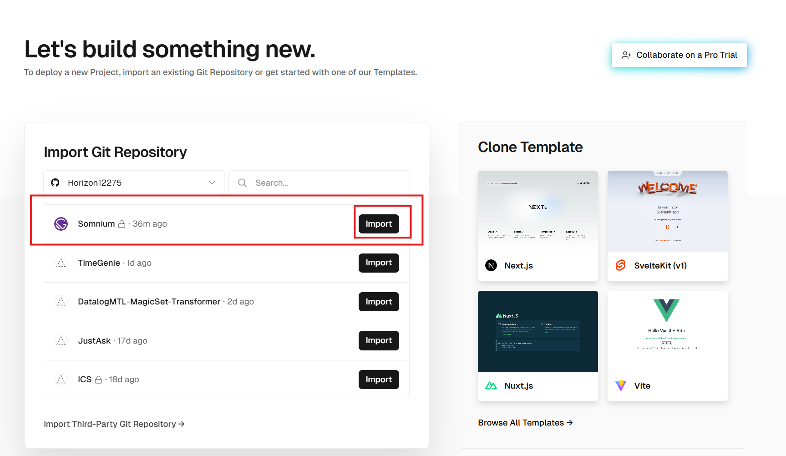

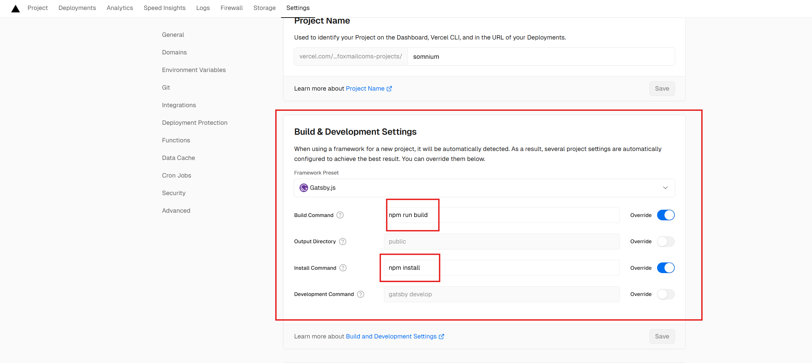

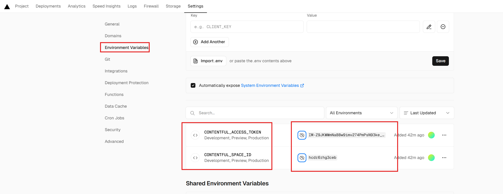

- 如何更新网站：当在 Contentful 上编辑更新好了文章之后、在这个网站的 deployment 目录下要手动去点击一次 redeploy 重新部署、然后这里重新部署的时候用 cache 会更快、只需要 1 分钟就能重新部署成功、在网站上显示最新写的 Blog

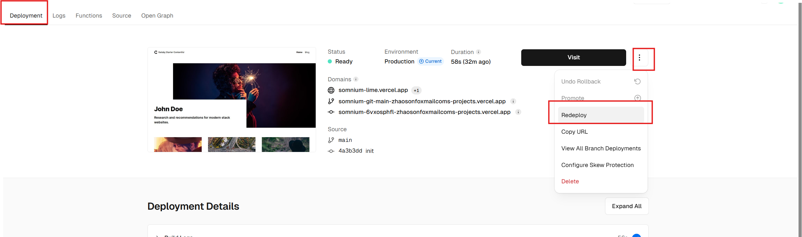

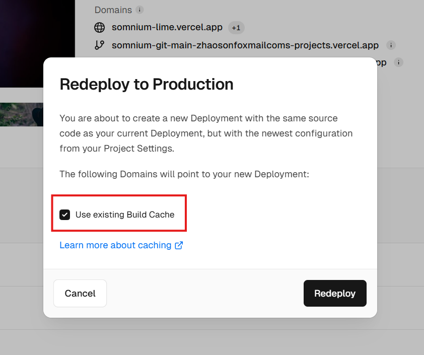
