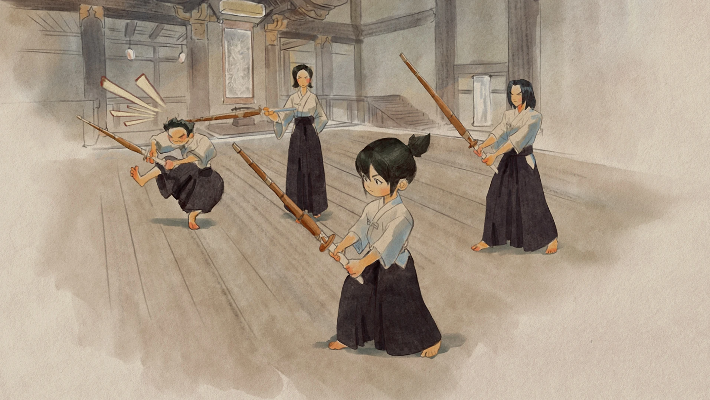

---

type: "post"
title: "Escape"
author: "Horizon#12275"
category: "Articles"
date: "2023-08-15"
slug: "/Article_2"
postImage: "./img/Article_2.png"
metaDescription: "当我坐在椅子上，木讷地盯着荧幕，正在搜索比赛的圆圈如同旧街坊里生锈的车轮戏谑般地滚动时，我明白了。"

---

&emsp;&emsp;*当我坐在椅子上，木讷地盯着荧幕，正在搜索比赛的圆圈如同旧街坊里生锈的车轮戏谑般地滚动时，我明白了。*

&emsp;&emsp;真的该到了彻底说再见的时候了。

&emsp;&emsp;我不知道。这可能之前从来没想过但是就好像这么轻易地就做出了那么艰难的决定了。也许以后的日子里还会想到这件事，就像今天半夜就算早睡了，也还是莫名其妙地在梦中又一遍遍地心碎了那样。我不知道。我想忘记，我真的想忘记，但是总是有时候在我根本没有一丝念想的时候，有些事情重新跳出来了。这真的不可能是我的错。这些年这样的日子真的数不胜数。甚至有一些梦里的场景我根本没有去硬要去记梦但是这些梦中的场景我现在还是能清晰地回忆起来，甚至里的情节。唉。我不想叹气。他也说了这件事情不怪我。不是我的问题。就这样吧。我不需要这些。跟我没什么关系。

&emsp;&emsp;现在还是趁此机会还能略带感情地捋一捋这些年来发生的一些事情吧。可能以后我真的不会再回头了。唉。又哭了一点点。

&emsp;&emsp;想到一开始，我用的是家里的30fps的一体机玩，我就记得画面一卡一卡的，有时候电脑还会死机，那时候网络也不是很好，但是那时可能对于我来说这就相当于打开了一扇新世界的窗户。真的。就算当时刷新率那么低，电脑那么卡，我还是会尽力地去开心地，认真地去玩每一场对局，就算是玩lucio，玩mercy，那时候的日子，也让我很开心。我知道可能我在fps游戏上并没有什么真正的天赋可言，但就像所有其它事情一样，我看到当时其他人比我更好的操作和分数的时候，我只想去不断地提升自己，然后不断地告诉自己自己好菜啊。但是可能和很多其他事情不一样，这件事情可能是我起点最低的一件事情了，我记得当时做一些其他事情的时候上手得真的很快。也可能这是我坚持了那么久的原因吧。哈哈。可能当时打个2500分的局都会紧张呢。但是当时也很好。我记得我借了三个兄弟的号当作小号在不断练习，想的是现在2000左右的低分先练习一下自己，再去玩Horizon这个号。现在想想，我确实还是那么搞笑啊。我怎么会这么不自信。我怎么会这么紧张。虽然我的确很菜。但是当时也很好。我也遇到了初中里玩得很好的一位学长带我一起玩。他也带我从2300到了2800分。我记得当时我只会玩mercy，他玩genji，那时还是第八赛季还是第九赛季的样子，月球基地这张第图才刚刚推出，mercy也从群体复活改成了最强的女武神版本。那时候每把蓝线刀还能砍得死人，赢得了团。但是当时也很好。虽然只有周末上好课回到家才能好好地玩游戏。虽然很多时候只有我一个人玩，或者只有两个人一起玩。但是每次周日下午我都会在小破电脑前坐一个下午，打开rank模式准备好好地上分。那种心情。真的很认真。真的也很紧张。哈哈。可能是不同类型和程度的紧张吧。但是我当时还总是希望自己能变得更厉害一点。

&emsp;&emsp;不知道什么时候和她分手的。可能分手之前还没有对overwatch有这样的情感寄托，但是分手之后我好像把所有的正面负面情绪都倾诉给了它一样。它也满足了我几乎所有的正负面情感需求。也许在现实生活里各方面成绩或者身体素质方面都还挺好，但是我还是觉得自己会不够好。当然也是另一种不够好。主要是感觉自己拿不出什么自己值得引以为傲的突出成绩或者拿手绝活这种吧。自己当时初中生，在那种环境下也没办法做出什么其他方面的突破。所以，或者是说也从某种角度上去想去证明自己有能力去做好一件事情。我就很想把overwatch玩好。当然这和其他事情不一样。我基本是完全靠一个初中生玩游戏的思维去确实在玩游戏地玩。在没有很高天赋的情况下，可能没有正确的方法和游戏理解的培养，死玩再多也作用不大吧，或者说成长曲线会很慢很慢。但是我还是那么倔。我可能自己会告诉自己自己一直是在坚持。有些事情我不会变的。但是现在回头看看也是浪费了很多时间。但是我的确坚持了下来。但当时也很好。

&emsp;&emsp;好像不想再哭了。好像现在很平静。虽然是一个人坐在床上。但是就像在和某人叙旧一样。好像现在也没那么伤感。反正都回不去了。

&emsp;&emsp;但是当时也很好。当时记得一次期末考得不错，换了台心心念念的新台式。9代i7，1060，60fps，上个学期还在用，现在还在我身边。我记得我第一款下载的软件就是battlenet，打开电脑组装好之后第一件事情就是下载overwatch好好地开玩。虽然现在玩240fps了，感觉60fps也是纯纯的垃圾。但是当时从30到60的时候，真的很好。真的很好。但是当时也很好。当我一个人打上3000，打上3200，打上3400，我还是那样子紧张，还是那样子不自信，感觉自己很菜。但是后来用brig自己打上了3500自己上了大师，就感觉自己很牛。但是后来又去亚服打韩国人，发现还是打不过，在亚服只有2500，又感觉自己很菜了。哈哈。但是当时也很好。在一盘盘对局后，我也渐渐地看懂了很多人玩这个游戏的心态，也学会了以自己的方式去阻止来自团队游戏中队友心态爆炸的干扰---每次感觉自己玩得不好了，就赶紧把所有人的聊天框和语音屏蔽掉。（笑）后来心态也放平了，可能知道自己也没法再把分数打上去了，就把它当成一款休闲游戏在玩，那时候真正地开始学会享受游戏的过程而不是结果，输赢对于我来说那时候也不再重要了。当时真的很好。

&emsp;&emsp;哦对了。可能在初三这年之后。overwatch就一直在走下坡路。游戏更新慢，新内容不多，外挂泛滥，负面新闻频出，内部管理混乱，业界舆论口碑暴跌。其实这些事一直有。在网上，在论坛，有很多人喷overwatch。但也可能是我那时胜负欲渐渐低了，我还是喜欢overwatch，还是觉得这些事情没什么大不了的，即使是它其中有两年的时间基本一点更新内容都没有，我还是会继续玩下去，就当成平常一件放松的事情。因为我后来也分析出我是因为享受于游戏本身时的那种绝对的专注和投入的过程，所以才一直保持下来这件应该可以说是爱好的。同样一直在走下坡路的还有整个overwatch生态环境和职业体系，如果不了解的话，可能很多细节我没必要多说，我也不想和自己再说一遍了。但是就从一点来讲，我初三那会看的比赛，喜欢的国内选手，到现在今天为止，在这个游戏快完全死掉之前，还是那些选手在打比赛，我支持的还是那批选手。（笑）但可能我就是偏偏更喜欢这些不被很多人关注的事情吧。

&emsp;&emsp;我不知道我做这些到现在还有什么其他意义。

&emsp;&emsp;如果从来没有overwatch这件事该多好。我肯定会更好的吧。

&emsp;&emsp;整理一下，该向前看了。

&emsp;&emsp;（其实只是昨天晚上喝了瓶啤酒加上学一天了有点累早点睡了，半夜醒了没事情做，随便写写的，本来都不准备再多写什么了，也真的不想多说什么了，爸妈不让我在这个点出去骑车，那就写点东西吧）

&emsp;&emsp;（写得好累啊，真不知道那些文化工作者是怎么每天写得出来那么多字的）

2023.8.16 凌晨三点

&emsp;&emsp;这个世界不需要我去治疗那么多人。如果我把纳米激素，充能音障，维生立场，增幅矩阵，聚合射线，英雄不朽，集结号令，生命之树，感受宁静，Kitsune都留给自己，那我才会unbroken！

2023.9.11 晚上十点

&emsp;&emsp;作注：就这样吧，别做任何删改，没写完的就不写了，天知道我是怎么写出这些东西的：D

&emsp;&emsp;年轻真好

2023.9.15 晚上十二点

&emsp;&emsp;我还是会看一些关于你的信息和内容。有时候也会偷瞄一眼群里大伙儿最近在讨论什么（（（我不知道

&emsp;&emsp;但是又发现了一个很让我开心的点：虽然哥不在了，但是江湖里还流传着哥的传说！（Vinlix居然说我是交大ow太子（真的笑死），还有tisuki，james和studoge也会聊到我）（唉，去年打新生杯的时候被大家伙轮番夸“都是Horizon大哥带我赢”的感觉真的是很开心呢！）

&emsp;&emsp;也在最后放一点当时的比赛录像吧，那天自己急眼了把b站的视频都删完了：

[OSU]（https://www.bilibili.com/video/BV1tW4y1n7UD?p=5&vd_source=23710c36ec67fcb89d3077992fb7fcf7），

[新生杯和内战](https://www.bilibili.com/video/BV1ce4y1y7fa/?spm_id_from=333.788&vd_source=23710c36ec67fcb89d3077992fb7fcf7)

&emsp;&emsp;被别人夸的感觉确实很好！