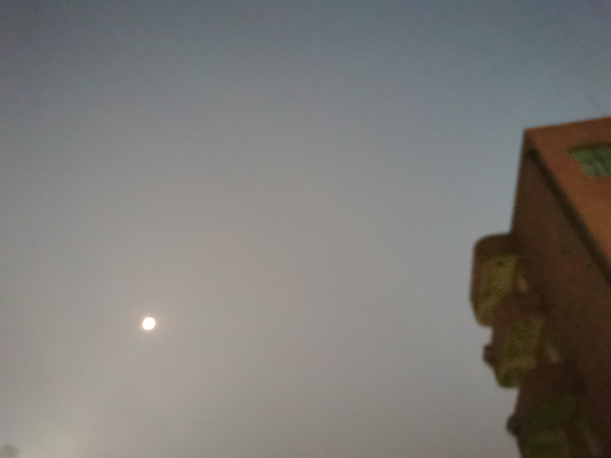

---

type: "post"
title: "Above The Clouds"
author: "HORIZON"
category: "Articles"
date: "2077-09-15"
slug: "/Article_4"
postImage: "./img/Article_4.jpg"
metaDescription: "既然大树上没有一片叶子敢于面对风的吹拂，露的浸润，霜的飘洒，整个树林也便成了没有风声鸟声的死林。"

---

&emsp;&emsp;*既然大树上没有一片叶子敢于面对风的吹拂，露的浸润，霜的飘洒，整个树林也便成了没有风声鸟声的死林。*

&emsp;&emsp;[他走向天空。](https://music.163.com/album?id=80604552&userid=507780576)

&emsp;&emsp;望着脚下铺上深苔的山峦，山顶尚未融化的白雪给了他一丝仅有的慰藉。但仿佛这层白雪又正以匪夷所思的轨迹消散，飞扬，最终形成了一团火。

&emsp;&emsp;“很好。”他说道，“原来雪花能够在燃烧的火焰中继续存在。”

&emsp;&emsp;他继续走向烟云。

&emsp;&emsp;眼前的山峦其实一直被一片温柔的海洋所包络，几幢木板搭建而成的小屋又星零地散在岸上，只有一艘纯洁但布满岁月痕迹的渔船在海面上扬着帆，缓缓地，起...伏...起...伏...配合着耳边略带腥气却又夹杂着一股青草香味的海风，构成了一幅他为之神往的图景。

&emsp;&emsp;“这就是那处Pu`uhonua O Honaunau（避难地）吗？”他心念道。

&emsp;&emsp;刹那间，他失去了平衡，自由落下。

&emsp;&emsp;正当他以为这一切即将结束的时候。一股力场的作用紧紧拖住了他下坠的速度，他得以缓缓地平稳落在这一片死寂中。他伸了个懒腰，打了个哈欠，感到背部的酸痛感减缓了许多。

&emsp;&emsp;“啊，久违的感觉。”他闭上眼睛。

&emsp;&emsp;但当他重新有力地站起来时，却发现自己正深处于一个冰窟窿里。他害怕地，急促地想握住那片由力场化成的光场，他奔跑着，脚边散落着的是一块块刻满可怕记忆的深色岩石，和一片片隐约闪耀着美好记忆的斑斓碎片。回忆如一根根锋芒般猛烈地向他刺来，正如一团他最害怕的急红了眼的蜂群，千方百计地想和他同归于尽。

&emsp;&emsp;光消失了。

&emsp;&emsp;他愣了一下，但却没有停下脚步。他义无反顾，他闭上双眼，相信自己所迈出的每一步都是更好的一步，他紧闭着双眼，他义无反顾。他最终还是没有停下脚步，但当他感受到一层淡紫色的光晕正透过他的眼皮围绕着他时，他愣了一下。

&emsp;&emsp;他发现自己正站在一块舞台上歌唱，刺眼的白光直照得让他睁不开眼睛。但他还是努力看清了，身后的蜂群已经成了一片尸体和残躯，落在了不远处城市街角的垃圾房里。

&emsp;&emsp;他转过头，不再往回看去。

&emsp;&emsp;他重新走向天空。沿着天空中一条灰色与淡紫色分明的交界线径直走去。透过身旁朦胧的纱般的雾，他能看到右手边灰色天空下一片死寂的城市，也能看到左手边生机尚存的Eichenwalde（中世纪城堡）。他在一条蓝白相间的冰道上小心翼翼地走着，生怕错过了身边貌似触手可及的星尘。

&emsp;&emsp;然而，然后，最后，渐渐地，整片天空都开始变得灰蒙蒙的。

&emsp;&emsp;原本绚丽的，蓝紫相融的，流动着的夜空和闪耀在外层的星晕全被一层带有一丝土黄色，最终变成灰色的尘暴给遮挡住了。

&emsp;&emsp;他醒来了。但他还在梦里。但这已经不重要了。
