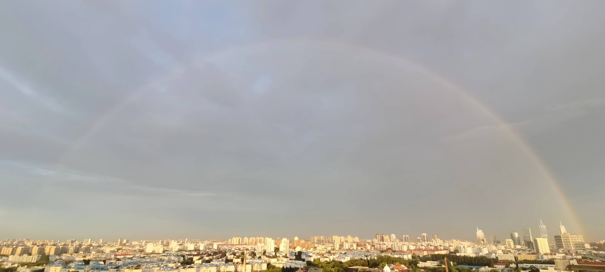
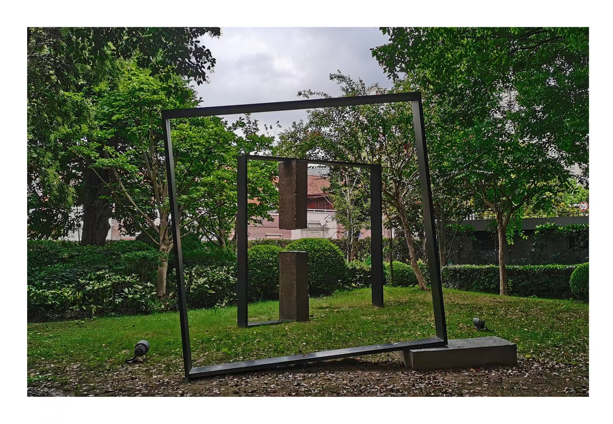

---

type: "post"
title: "Internship"
author: "Version 1"
category: "Articles"
date: "2023-09-08"
slug: "/Article_5"
postImage: "./img/Article_5.jpg"
metaDescription: "每当我停下前进的脚步，我都希望我能回想起让我如今依旧感到振聋发聩的那句话：“未来是无限广阔的”。然后继续坚定地向前走去。"

---

&emsp;&emsp;*每当我停下前进的脚步，我都希望我能回想起让我如今依旧感到振聋发聩的那句话：“未来是无限广阔的”。然后继续坚定地向前走去。*

---

&emsp;&emsp;或许因为本来就没想过要从这里学到点什么，一直抱着的是混日子过来打发时间做自己的事情的心态。因此，第一天走进办公室的时候，即使单调的桌椅布局可能有点压抑沉闷，但我似乎和这里处在完全不同的另一个世界，游离在办公桌旁。

&emsp;&emsp;突然，一位神态似曾相识的上海老爷叔向我走了过来，主动热情地向我介绍了我这次实习的带教老师和办公室整体情况，当我们用熟练的上海话交谈嘎珊瑚时，我整个人好像才真正地回到了办公室里，尝试地去融入这一个新的环境。我们从生活聊到教育，从教育聊到社会，他问我答，他答我问，一来一往，乐此不疲，一直聊到中午。去吃饭的时候，我不经意地问他道，“老思侬兹耶泽磊给各桑杯额咯（老师你是一直在这里上班的咯）”。“兹啊，塞铯杜霓了（是啊，三十多年了）”。

&emsp;&emsp;是啊，三十多年了。我的一生还能有几个三十年呢。

---

&emsp;&emsp;实习的内容说新鲜也并不有趣，说单调也并不乏味，每天总是能或多或少了解到一些新的技术和名词，包括被拎去开会旁听时看到了海量的新信息和新内容，自己也记了记很多笔记在Onenote上。（如MSTP，OTN，云专网等等等等）

&emsp;&emsp;一天会议结束后，我猝不及防地又被部门里的Boss拉去谈话，当时我心里其实还是挺慌的，因为自己根本没有做什么准备，脑子里也对很多概念都是空空的，不是很上心。但是坐到座位上正式开始聊天时，我才庆幸自己之前确实做了很多有内容的笔记。我照着笔记上的内容一点点回答完他的问题之后，他说，“你现在做的笔记已经非常好了。我们也希望你这次一个月也没有白来。但是我更希望你可以把这些笔记里做好一些分类和归纳的步骤，这样自己对于整个工作才会更清晰。一定要这么做，这样才能知道自己工作的时候在干什么，真正上班之后没有人会教你这些东西，都要靠自己积累和整理的。”

&emsp;&emsp;我若有所思，觉得他说的话确实有一番道理。第二天，我就根据之前的笔记，像模像样地做了一幅可看的思维导图（由于保密协议这里就不发了，可私：D）。

&emsp;&emsp;真正到了自己第一份工作的岗位时，谁会教我这些呢。

---

&emsp;&emsp;中午的时候，有时会一个人去街角的静安区雕塑公园逛一逛，走一走，想一想。虽然旁边就是自然博物馆，但是总感觉人好多，不想进去看。不如一个人在公园里瞎溜达，思考着怎么正常和自己独处，更新自己内心思维方式的版本，也听完了一段有史以来可能[最让我感同身受的独白](https://www.bilibili.com/video/BV1bp4y157Ej/?spm_id_from=333.788&vd_source=23710c36ec67fcb89d3077992fb7fcf7)。让我觉得应该在之后的日子里将这些思路发挥到极致，由内而外地重新塑造一个全新的自己。

&emsp;&emsp;当然，在公园里也看到了很多富有艺术气息的雕塑和绽放的花朵，但总感觉他们还是千篇一律，便没有记录。唯一记录下来的就是这副图片。

&emsp;&emsp;这种纵深错位的感觉。

---

&emsp;&emsp;临近实习的最后一天，国企的实习渐渐地变得不再新鲜有趣，纷繁冗杂的流程和制度让我的内心里更多地产生了一种抵触和想要赶快逃走的心理。

&emsp;&emsp;书记人很好，当我走进他的办公室里和他谈话的时候，他客气地邀请我以第三方的视角对整个部门内部提提建议。我对他说我感觉这里的很多事情其实并没有那么复杂，开会的时候讨论的根本不是要为了解决项目实际落实的问题，而是想办法怎么应付上级集团的审查，避免被更高的领导问责，但我也表示理解这一点。

&emsp;&emsp;他苦笑了笑，以一种温和而无奈的语气说道，“很多事情其实就像你说的这样，作为一个大公司，即使是像微软这样的外企，也会有很多规章流程的制度，这和小企业的做事方式截然不同。”

&emsp;&emsp;他又问了问我的近况和我未来的打算。我就如实告诉了他最近着手在做的几个事情以及对很多人都说过的目标和规划。他也对我在做的事情表示出了不小的兴趣，似乎每一个角度都有问到细节的方面。

&emsp;&emsp;我离开前的最后，他又笑了笑，对我说了一句如今依旧让我感到振聋发聩的那句话，“好好努力，未来是无限广阔的”。

&emsp;&emsp;我才感受到，可能自己真的不像之前自己所想的那么差。我应该继续走下去，把握当下，追逐那片广阔的未来。

---

&emsp;&emsp;其实在这短短的一个月里，还认识了很多有意思的人或者说是同事，可能因为我是实习生，他们也对我很友善。但是最有意思，最让我反复品味的莫过于一位也是我们大学，我们专业的大四毕业学长。他人很好，对我说：“加油学弟，以后不要沦落到来这种单位！”我会心一笑，却又感到如今这个社会血淋淋的现实也正向我逼近。

&emsp;&emsp;最后一天回家的地铁上，本来不想哭的，但还是忍不住哭了一小会...虽然就像我不会再怀念所有的小学，初中，高中一样，我不会再怀念这里，还是有一种伤心离别的感觉。

&emsp;&emsp;我也许是在逃避很多东西，但我会把握当下，珍惜现在所拥有的一切机会，未来是无限广阔的。

