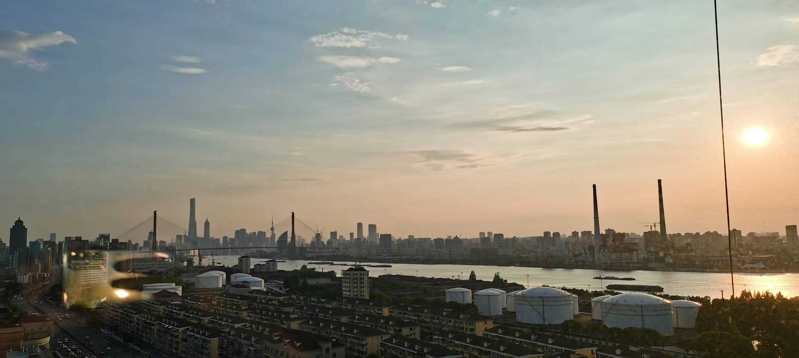

---

type: "post"
title: "Chaimes"
author: "Horizon"
category: "Articles"
date: "2023-08-20"
slug: "/Article_6"
postImage: "./img/Article_6.jpg"
metaDescription: "一篇关于自己的心结和如何解开自己心结的文章，也尝试着探讨游戏发展的过去和未来。"

---

&emsp;&emsp;*一篇关于自己的心结和如何解开自己心结的文章，也尝试着探讨游戏发展的过去和未来。*

&emsp;&emsp;可能去放弃，去抵触一件你始终热爱的事情其实很简单：**去投入你的所有，去爱它爱到极致，然后得不到相等的回应**。

&emsp;&emsp;虽然最近也受到了很多之前一起玩overwatch的小伙伴的邀请，自己也并不是绝对地厌恶这款游戏，但内心里一想起那天晚上，还是会有一股对它猛烈的抵触心情涌上心头。我至今还无法明白，我为什么打得那么认真，数据那么好看，模仿着职业的思路意识，也做了很多关键的影响局势动作。还是输了。算了，就过去吧。

&emsp;&emsp;可能对于之前的我来说，游戏就是生命，我粗略计算了一下，从初三开始自己平均每天花费在这方面的时间居然达到了3个小时。但或许和很多人一样，在高考完那个暑假，自己其实并没有想玩什么游戏的欲望了。我才猛然发现，这可能更是我一种逃避去面对现实的手段。

&emsp;&emsp;游戏里的一切都是美好的，都是可控的；与之对比，现今的教育制度下仿佛容不得你一点差错。这种制度是令人厌烦的，应试教育既没有达到其思维层面考核的高度，又要刻意地从细节，偏怪的角度上去恶心你，最后还告诉你，一场考试就能确定部分人未来的社会地位。我只能原谅自己，在这种制度和糟糕的学校氛围下，又因为自己刻意地逃避很多原本应该去面对的东西，我才会如此留恋于这份虚拟的美好吧。

&emsp;&emsp;即使对我来说，玩游戏是为了逃避，是一种无奈之举，但我却的确借此机会体会到了游戏的真实魅力，很多游戏给我留下的不止是其优秀的玩法和制作，更给我留下了许多美好的回忆。在the Witcher III时，我还记得与叶奈法在群岛雪山上的邂逅，让我怀念这种感情；在Overwatch里，我也与好友或是陌生人打出过精妙默契的配合，我喜欢着作为一个辅助玩家被他人需要的感觉；在Starcraft2中，我享受着专注操作的乐趣......但很可惜，我的这种感觉似乎并不能代表什么。

&emsp;&emsp;“原神”，“中国文化”，“文化自信”......真可笑啊。泱泱大国居然接受了这样的设定：需要一定程度地利用一款二次元网游去宣传自己的“文化”。诚然，我玩游戏一开始也是因为跟风，也是因为社交，但是我从没想过一个国家的内宣会无耻到这种程度，甚至还有一批不知道是串子还是真低能的跟风狗拥趸时刻追随着这样无耻的领导。这就像“打赢了大上海保卫战”一样，无时无刻不令人作呕，唾弃。我讨厌这种玩家群体，我也讨厌各种利用这些低级的粗制滥造的所谓“游戏”，利用信息差去肆意圈钱的制作商。就像各种国货，国产，“突破卡脖子”的很多产品一样，明明和如今最先进的技术还有着不小的差距，就喜欢在这吹牛，圈钱，给国内的消费者低品质的产品，“高品质”的“自信”。

&emsp;&emsp;在这一方面，国内游戏厂商尤为恶劣，明知道别人能做出优质的游戏内容和产品，却因为闭关锁国的国情，吃着信息差的红利，大笔大笔的捞钱。我以为，这种品质甚至是比“原神”更差的诸多游戏，造成的负面影响是长期的，在此请读者自行体会，就不多赘述了。

&emsp;&emsp;但显然，与政府二十年前视电子游戏为洪水猛兽的态度截然相反的是，如今的电子游戏不仅广受推崇，而且还选了一堆“垃圾”作为杭州亚运会的项目的噱头。那想必背后的利益输送是再正常不过了。有一些事情，如果被上升到了宣传的层面，那就不仅仅是“萝卜青菜各有所爱”的关系了，我认为这样的宣传是不负责任的。但无奈的是，为官者好像本来就不用对群众对未来负什么责任：D

&emsp;&emsp;但最近的闲暇时分我也会想，我设想中的游戏世界应该是什么样的，也许我可以利用先前积累的游戏体验和知识，从游戏底层的游戏引擎入手，创造我自己的世界。而对于游戏的载体，我以为手机游戏应该彻底被废止，因为这仅仅是政府收税和控制民众的一种最简单的方式。而游戏的未来或许就像《头号玩家》那样，利用不断演进的可穿戴式设备，给人最真实的体验，讲述最美好的故事吧。