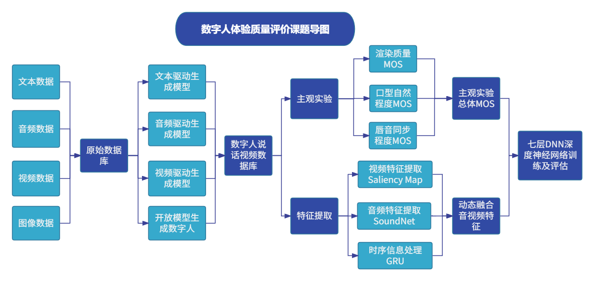
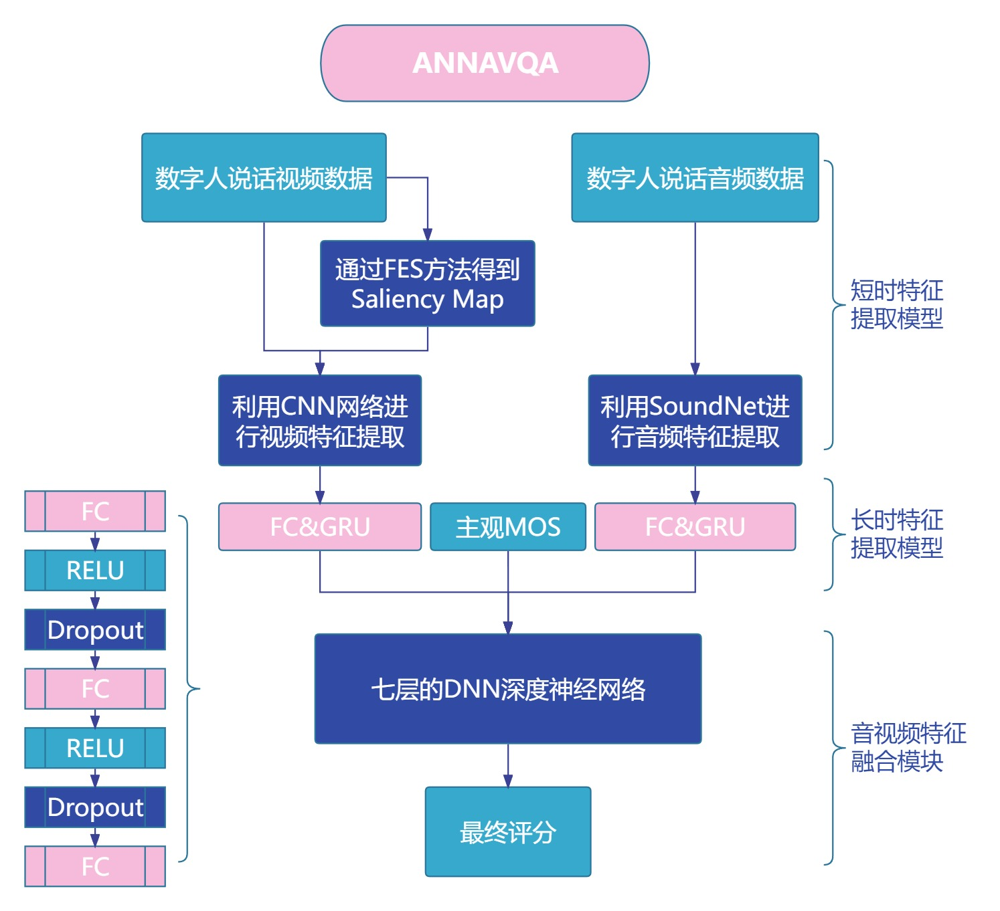

---

type: "post"
title: "Dive"
author: "horiZON"
category: "Articles"
date: "2023-09-27"
slug: "/Article_8"
postImage: "./img/Article_8.png"
metaDescription: "当他在玉兰苑二楼的书店里仔细翻看数学相关的教科书时，我居然有一种想哭的感觉。也许是被他这样对数学学科的热爱所打动，也可能是怀念自己以往那份早已泯灭的固执与坚持。"

---

&emsp;&emsp;***当他在玉兰苑二楼的书店里仔细翻看数学相关的教科书时，我居然有一种想哭的感觉。也许是被他这样对数学学科的热爱所打动，也可能是怀念自己以往那份早已泯灭的固执与坚持。***

&emsp;&emsp;今天也算是结束了本次PRP的所有工作吧。今天前面学了做了好多事情，也没有什么想现在学的东西了，现在就略微总结一下参与这次PRP的感想吧。

&emsp;&emsp;其实，只要能静下心，释怀一些执念，心里不去杂想，那么去做一项研究，去啃一本生书，也就像喝水一样简单吧。回想到今年寒假的时候第一次接到这份任务，感觉那时候很急，很慌张，不知道从哪里去下手。我记得，就连一个最简单的，利用独立安装的pytorch+cuda环境，去执行对应的视频生成算法时，我都急不可耐。现在想想，我都不知道我那时候在急些什么。为什么我就不能好好静下心来仔细读一读每一篇论文，做好一次次整理呢？ow真的有那么重要吗？

&emsp;&emsp;后来，我也试着用日程表去规划PRP的进程，但是总是还是在自己规划的日程的最后ddl前才完成自己目标进行的内容。也许是上学期课程确实累，确实需要时间适应。但是就像逃避所有舒适圈外的东西一样，到了PRP的主观视频质量评价部分，我还是选择一拖再拖。其实做到这块部分的时候才四月，我已经做得很快了，我已经做得不错了，但是直到9月了要结项了，我才能重新鼓起勇气，或者是被ddl的催命符喊醒，继续项目的研究。我不知道为什么。

&emsp;&emsp;也许是面对压力的时候选择通过不断地玩以前的游戏，去想找回以前的那种感觉吧，但是结果呢。有些感觉，你越想拼命抓住，你陷得越深：就算我再怎么和当初的大哥一起玩Destiny2，也回不到19年疫情时那段丧心病狂自暴自弃的颓废时光了；就算我再怎么努力打overwatch，我打到了宗师3，我几乎和每一个从初中就开始喜欢看的ow主播都同场竞技过了，我又排到了当初，在18年的那个成都的暑假给我带来无限快乐的职业选手们，我排到kyo，排到samsara1246，排到ameng，排到aprita，zest，mn3，fixa，skewed，pw，mzm….那又怎么样了呢。也许我确实有一些实力，也许他们也都认可我的实力，但是，人总之还是要敢于走出自己的舒适圈，走出自己的回忆的。

&emsp;&emsp;直到9月。我试着改变一些自己原有的做法，我试着踏出那先前从未踏出的那一小步，踏出那从未踏出的每一步。我算是咬着牙，带着有点抵触和胆怯的心理去读完了ANNAVQA的论文，联系了学姐进行客观质量特征的提取；我厚着脸皮，请室友帮我把自己没法做也不想做的主观质量评价MOS给做完了；又腆着脸，去联系导师，去问项目相关的内容，去询问专业未来的方向。其实他们都很好，我也没那么糟糕，我应该多去沟通询问，而不是一味地逃避，责怪自己。也许对于很多人来说，这些事情很自然，很简单。但我感觉，做完这些事情之后，我好像真的又有了自己的动力，我好像正在以飞快的速度变成自己想变成的那个样子。是啊。我应该先带着自己走好自己的路。

&emsp;&emsp;总之，这几个月里，也许是觉得自己真的尽力了，也许是因为放弃了一些执念，也许是因为这一次特别的实习经历。我切切实实地感受到了很多在自己身上发生的变化。现在再回望这次PRP项目的经过，也许我能做得更好，也许本身真的能发出一篇论文玩玩，但是有时候人就是应该原谅自己，责怪他人。因为人是有局限性的，我也是有局限性的。
