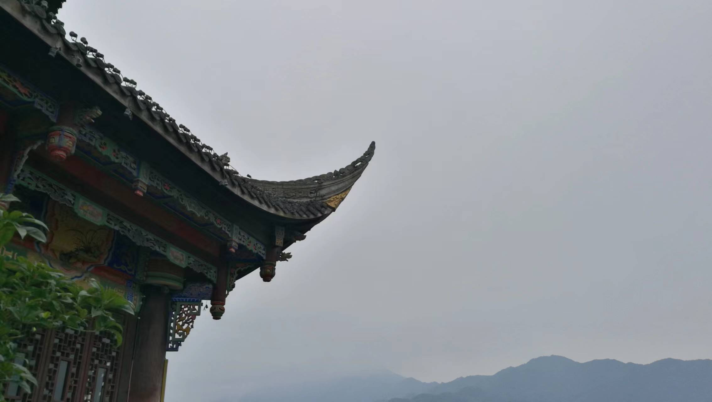

---

type: "post"
title: "NULL"
author: "%"
category: "Moments"
date: "2023-09-13"
slug: "/Moment_3"
postImage: "./img/Moment_3.jpg"
metaDescription: "我见过的那只猫，皮毛如月光一样皎洁，在房顶上走过。--《黄金时代》王小波"

---

&emsp;&emsp;**我见过的那只猫，皮毛如月光一样皎洁，在房顶上走过。**

&emsp;&emsp;翁布罗萨不复存在了。凝视着空旷的天空，我不禁问它是否确实存在过。那些密密层层错综复杂的枝叶，枝分杈、叶裂片，越分越细，无穷无尽，而天空只是一些不规则地闪现的碎片。这样的景象存在过，也许只是为了让我哥哥以他那银猴长尾山雀般轻盈的步子从那些枝叶上面走过。那是大自然的手笔，从空白开始不断添枝加叶，这同我让它一页页跑下去的这条墨水线一样，充满了画叉、涂改、大块墨渍、污点、空白，有时候撒成浅淡的大颗粒，有时候聚集成一片密密麻麻的小符号，细如微小的种籽，忽而画圈圈，忽而画分叉符，忽而把几个句子勾连在一个方框里，周围配上叶片似的或乌云似的墨迹，接着全部连结起来，然后又开始盘绕纠缠着往前跑、往前跑。纠结解开了，线拉直了，最后把理想、梦想挽成一串无意义的话语，这就算写完了。

&emsp;&emsp;别再被情绪所左右了。要平和，要学会控制自己的情绪，要坚定自己内心所想的事情。所有的外界事件都没那么重要了，重要的是在情绪波动的时候一遍遍告诉自己：今天自己比过往的任何一天都要过得更好。一步步走下去，一天天过下去，不要狂躁，不要游离，不要自艾，就平和一点，冷静一点吧，真的都会更好的。