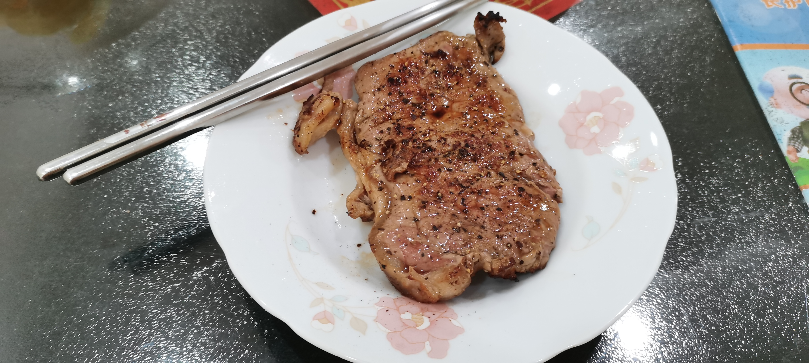
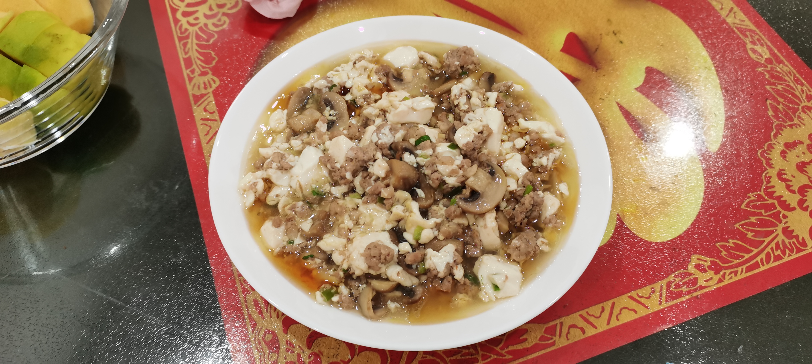
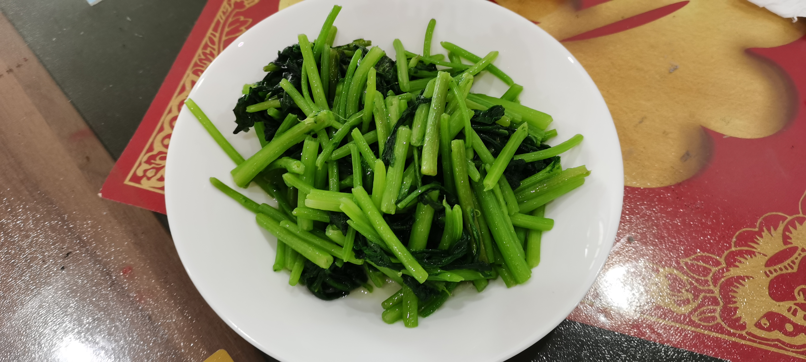

---

type: "post"
title: "Life"
author: "Horizon"
category: "Moments"
date: "2025-01-04"
slug: "/Moment_5"
postImage: "./img/Moment_5.jpg"
metaDescription: "生活就是这样，有时候你会觉得自己很幸福，有时候你会觉得自己很痛苦。"

---

## 1.4

1. 牛排

    - 150g 3分半、200g 4分钟
    - 可以煎之前放海盐和黑胡椒
    - 焦一点的话、就先煎一面2分钟、再煎一面1分钟、然后关火再用余温煎一会
    - 不焦就一分半
    - 黄油
    - 煎的时候不要翻来翻去、煎一面就行

2. 豆腐肉末蘑菇

    - 肉末：料酒，黑胡椒，葱，略微放点盐
    - 豆腐：用刀切开、可以直接切开塑料膜
    - 蘑菇：切开来，清水洗干净
    - 放油、然后冷油直接炒肉末、注意要把肉末炒松炒散即可，然后散了之后拿出来
    - 再放油、然后炒蘑菇、炒到差不多了就可以了，拿出来
    - 然后放豆腐、直接倒进去、不要放油，然后再把蘑菇盖在豆腐上面（为了让豆腐受热均匀）
    - 蘑菇和豆腐焖一会、再放肉末、然后肉末放完可以撒点盐
    - 注意这里的炒需要轻一点、然后从底炒起、不然豆腐会散掉，可以做几次操作
    - 然后中小火再焖，焖到感觉差不多了就行
    - 勾芡多放一点水淀粉和水、然后搅拌均匀再放进去勾芡，勾芡的时候要分几次、不然会团在一起
    - 最后盛出来然后放麻油就行

3. 炒茼蒿

    - 放进去的时候开小火
    - 中大火炒
    - 生菜、油麦菜要放大蒜先爆香
    - 茼蒿先用手扳成小段

4. 一个菜烧完洗一下锅，不然会重味

5. 基本上都用中火炒就行，放东西的时候可以开小火