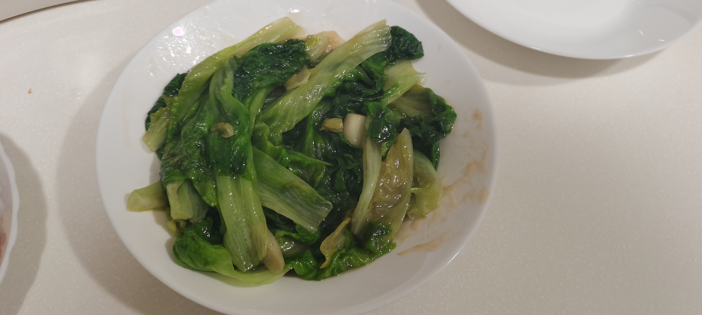

## 12.31

1. 冰糖水果：

   - 冰糖：当时用的是白砂糖，用更细的白糖应该也行，注意水不要太多、应该是两勺糖，一勺水的 2：1 的比例（融化不掉是正常的），然后微波炉里去转，至少要 3 分钟、然后可以注意到这个小碗里面、从冒大泡到冒小泡就可以了，但是注意要快、因为这个糖冷掉之后就会黏在碗底，就用不了了，就算再加水再转也没有用。
   - 冰水：可以在净水里放几块冰块会好一点，加强冷却效果（去买冰杯或者自己做）。
   - 水果：这里当时用的水果是菠萝蜜和草莓，然后可以用竹签把它们串起来之后再放到糖浆里面去滚一圈、然后再放到冰水里面去冷却一下就好了。当时能听到清脆的敲击声，而且就像冰糖葫芦一样。草莓也可以单独串一根。

## 1.4

1. 牛排

   - 150g 3 分半、200g 4 分钟
   - 可以煎之前放海盐和黑胡椒
   - 焦一点的话、就先煎一面 2 分钟、再煎一面 1 分钟、然后关火再用余温煎一会
   - 不焦就一分半
   - 黄油
   - 煎的时候不要翻来翻去、煎一面就行

2. 豆腐肉末蘑菇

   - 肉末：料酒，黑胡椒，葱，略微放点盐（100g 不到）
   - 豆腐：用刀切开、可以直接切开塑料膜（一盒）
   - 蘑菇：切开来，清水洗干净（3 个，口蘑，然后把根切掉、然后正常切正常洗就可以了）
   - 放油、然后冷油直接炒肉末、注意要把肉末炒松炒散即可，然后散了之后拿出来
   - 再放油、然后炒蘑菇、炒到差不多了就可以了，拿出来
   - 然后放豆腐、直接倒进去、不要放油，然后再把蘑菇盖在豆腐上面（为了让豆腐受热均匀）
   - 蘑菇和豆腐焖一会（盖上盖子焖）、再放肉末、然后肉末放完可以撒点盐
   - 注意这里的炒需要轻一点、然后从底炒起、不然豆腐会散掉，可以做几次操作
   - 然后中小火再焖（盖上盖子焖），焖到感觉差不多了就行
   - 勾芡多放一点水淀粉和水、然后搅拌均匀再放进去勾芡，勾芡的时候要分几次、不然会团在一起
   - 最后盛出来然后放麻油就行

3. 炒茼蒿

   - 放进去的时候开小火
   - 中大火炒，放盐
   - 生菜、油麦菜要放大蒜先爆香
   - 茼蒿先用手扳成小段

4. 一个菜烧完洗一下锅，不然会重味

5. 基本上都用中火炒就行，放东西的时候可以开小火

## 1.5

1. 芹菜豆干牛肉丝冬笋

   - 芹菜：买回来、把根剪掉、然后把顶部的大叶子剪掉、因为大叶子是老的、小叶子是嫩的。然后清水泡 3 轮、把泥土泡干净、然后再搓一搓。然后泡干净之后再切成中段，用手扳也可以。（200g）
   - 豆干：买回来、冲一冲、然后再切开来
   - 牛肉：网上买一下 或者去菜场买现切的牛肉丝、然后回来之后放点料酒和黑胡椒（牛肉丝料酒可以放少一点、猪肉丝因为味大所以可以放多一点料酒）然后拌匀（好像不需要冲水）（150g）
   - 冬笋：网上买一下 现场就看长得差不多的就行，然后冲一冲拨开来、拨到差不多能吃的颜色（没有黑色的毛），然后冲一冲开始切、然后先可以用削皮刀把茎上的一些黑色的皮给削了（就一点点就行），然后再把根切掉（差不多 1 根半手指粗），然后开始切、可以分两轮侧过来斜过来切、然后切的时候大拇指摁在上面用力，然后切成中丝（太细容易断掉，太粗不好吃），然后焯水、水开了放进去焯 30s-1min。然后撩出来（也可以用漏网把水漏掉再撩）（一根）
   - 然后先炒肉，炒松、然后拿出来
   - 然后放芹菜，炒到断生放冬笋、然后放盐、然后放豆干（因为豆干本来就是咸的），最后放牛肉（因为不然牛肉就老掉了）

2. 红豆薏米水

   - 红豆：先泡 1 个多小时，泡软
   - 薏米：洗一下、然后带水进去干炒，炒到有焦黄色就可以了
   - 然后等薏米凉了之后、放到红豆锅里一起泡，等到 1 个多小时之后、把泡的水倒了
   - 然后再加净水一起煮，水开了就可以了。
   - 或者放电饭煲里、多放点水然后用煮粥档就可以了

3. 白灼虾

   - 生姜：用牙刷洗干净泥土、然后把外面的接头切了、然后切片、薄一点也行
   - 小象超市 1 斤 基围虾，拆开袋子
   - 先洗虾，把水冲干净、然后就差不多每一轮就抓住一只虾然后水里晃一晃就行了，然后放到盆子里、要洗三轮、然后洗的时候放冷水、不要放热水、不然不新鲜了
   - 这里的油不要放太多、先油煸生姜、火不要太大（不然虾会丢失水分）（如果有葱、这里也放点葱进去煸）
   - 煸差不多了然后把虾放进去、这时候可以迅速放一点料酒、然后盖上盖子一直焖，闷到差不多了，用筷子翻面、然后再焖一会，焖到差不多了就可以了

4. 牛排

   - 拿出来之后先吸水纸吸一吸、然后海盐黑胡椒腌一腌
   - 然后放冰箱里
   - 化黄油的时候可以不用动（因为有时候只放半块黄油，就化着就好了）

## 1.7

1. 水
   - 水，滤净水，不要直接用自来水
   - 红糖，一开始就放进去，可以最后烧完再加一点、增加甜味
   - 红枣，冲一冲、感觉切不切片都可以，这次选择没有切片、感觉切片有点怪、然后一开始的时候就放进去
   - 姜，皮是寒性的、所以削去皮之后，切成姜丝、然后一开始的时候就放进去
   - 鸡蛋 2 个，打好放碗里备用，最后水烧开了之后做水波蛋。然后这里要注意放水波蛋的时候要关火、然后焖一下不动就好了，不然会散掉。
   - 桂圆干，清水冲一冲再放进去，感觉应该烧开了再放进去、不然就吃水软掉了
   - 枸杞（没加），也可以洗一洗再放进去、但是可以晚一点放、因为这个枸杞不耐煮

## 1.18

1. 油麦菜

   - 剥开来，洗干净，洗 3 轮
   - 然后切成中段
   - 然后蒜切成小块
   - 然后蒜爆香之后再放油麦菜就可以了

2. 葱油拌面

   - 油可以放多一点，最后放酱油也可以多一点
   - 葱可以多一点、火大一点
   - 葱焦了葱油就好了
   - 煮面的时候可以放盐让这个面劲道一点

3. 番茄蛋汤香菇

   - 普罗旺斯番茄、剥皮的时候先用勺子在表皮挖一下，然后直接剥开
   - 香菇洗干净根然后切开来
   - 放不放盐无所谓
   - 最后蛋液放进去就可以关火了

## 1.19

1. 手撕包菜

   - 卷心菜，五花肉（五花肉不要现切的，要自己切的）
   - 五花肉到点料酒去腥
   - 包菜先切半，然后斜刀切掉根（3 个人半颗差不多）
   - 然后只用洗一遍包菜，拨完包菜之后手撕成小块，手撕的部分不要再洗了
   - 准备调料，酱油，醋，盐，耗油，糖
   - 然后准备炒五花肉的姜，蒜，干辣椒
   - 然后先炒包菜，大火炒到半熟软了，乘起来，会更干一点
   - 然后拿出来，炒五花肉，然后倒姜，蒜，干辣椒，炒一会放刚刚炒好的包菜
   - 然后大火炒，炒一会然后倒调料就好了。

2. 小酥肉

   - 腌肉的时候可以放点料酒、黑胡椒、盐（耗油）
   - 拿里脊肉先自己切成手指粗细，然后腌制
   - 然后用小酥肉粉和水 1：1 拌裹料，然后肉放进去
   - 然后炸，注意要炸两次，油可以放多一点、油铺满底
   - 最后可以开大火煎至焦黄

3. 大白菜肉丝年糕笋丝

   - 肉丝腌制：料酒、黑胡椒、盐
   - 年糕先水里泡一泡，浸软（3 人份 4 根年糕）
   - 香菇切好
   - 笋切丝，然后焯一轮水撩出来
   - 大白菜和油麦菜一样的处理
   - 然后先炒肉丝、肉丝断生分离然后撩出来
   - 然后大白菜蘑菇一起放进去炒，然后放盐，盐可以多一点因为有年糕
   - 炒一炒然后放笋丝肉丝，再炒散一点
   - 然后放年糕，均匀铺在菜上面，然后盖上盖子焖一会，焖到年糕软了就可以了

4. 羊排

   - 京东的羊排 宁夏盐池
   - 腌制：料酒、黑胡椒、盐、耗油
   - 烤之前先在表面倒一点橄榄油
   - 然后烤的时候烤箱先预热，至少 220 度，然后撒点孜然烤箱里烤就行
   - 然后烤一块的话，第一面 15 分钟，第二面 12 分钟。

5. 砂锅汤

   - 粉丝要先开水过一遍，然后泡软了撩出来放冷水里，这样粉丝不会糊掉，然后放旁边备用
   - 砂锅里倒水，可以先放有鲜味的东西进去，比如香菇，百叶结，油豆腐，然后煮开
   - 煮开之后乱七八糟东西放进去，就是火锅

## 1.20

1. 蚝油生菜

   - 生菜洗净，准备大蒜
   - 然后大蒜爆香，然后放生菜，生菜放进去的时候就放耗油，半锅铲就行
   - 最后快熟了就放水淀粉、分几次倒水淀粉，水可以稍微多一点

2. 咖喱土豆牛肉

   - 牛肉先去血，水里泡 5 分钟，然后洗净血，然后焯水，煮 30 分钟，然后和汤一起留着
   - 然后土豆切块，先在水里跑一下，泡掉表面的水淀粉
   - 然后倒油先炒土豆，炒到里面熟了，然后再倒牛肉和牛肉汤，然后大火焖煮
   - 然后差不多了就放咖喱块，放四块，然后化了之后搅拌均匀，然后再焖一会
   - 焖的时候也要搅拌一下、不然会沾底

## 1.21

1. 鸡汤

   - 半只鸡，洗净搓一搓
   - 准备葱整根，姜切片，然后倒点料酒和鸡一起放在高压锅里
   - 然后加水，水要没过鸡就行，点烧汤挡
   - 放气的时候垫一块湿抹布在口上
   - 然后准备笋和油豆腐
   - 冬笋需要先烫一下，然后滚刀切块
   - 然后油豆腐也需要先煮一下，煮软，然后可以剪一下口子，更入味
   - 最后高压锅里的鸡和汤拿出来和笋和油豆腐一起放锅里，再煮一会就好了

2. 菠菜

   - 洗菠菜的时候要多洗几轮，因为菠菜有泥土，可以把外面几层包的叶子剥掉、根搓一搓留着
   - 然后用开水把洗好的菠菜烫一下，然后撩起来
   - 然后大蒜切块爆香，然后放菠菜，放盐，然后炒一下就好了

3. 蛋饼土豆丝

   - 土豆切丝（先切片，然后叠在一起可以一起切）
   - 然后切完丝水里过一遍、洗掉表面的淀粉
   - 然后打 3 个蛋（蛋液里放葱），倒进土豆丝里
   - 然后可以放面粉或者不放面粉
   - 油可以多一点、和滑蛋差不多
   - 然后整盆放进去就行、和煎蛋一样，翻几面，等土豆熟了就行了

