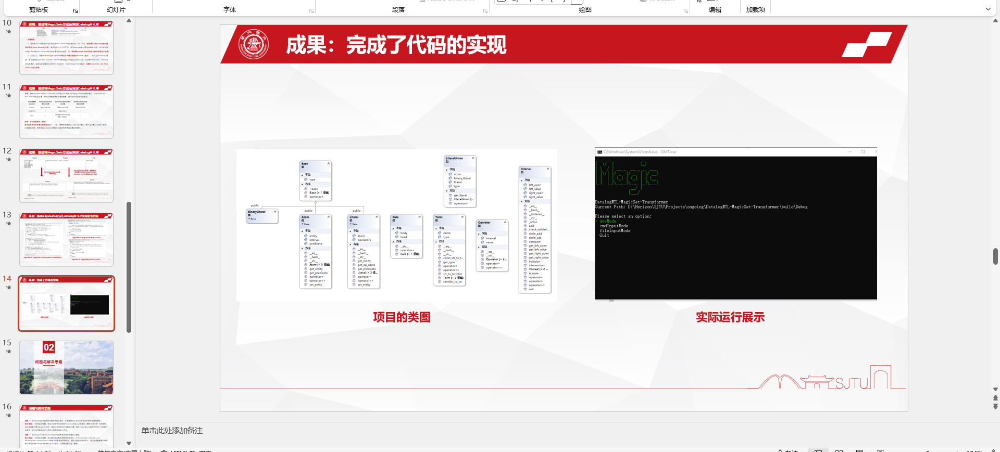
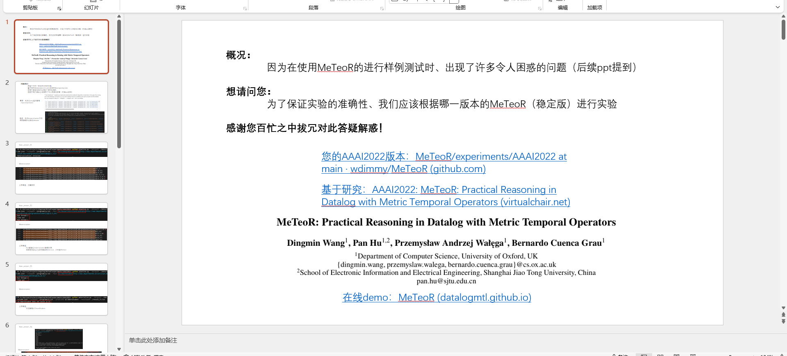
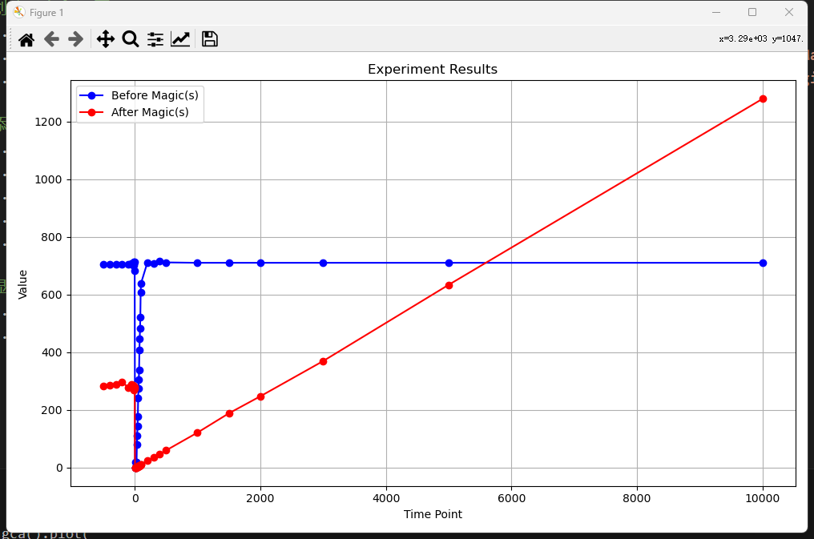
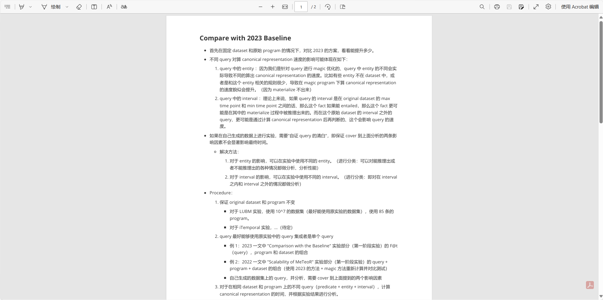
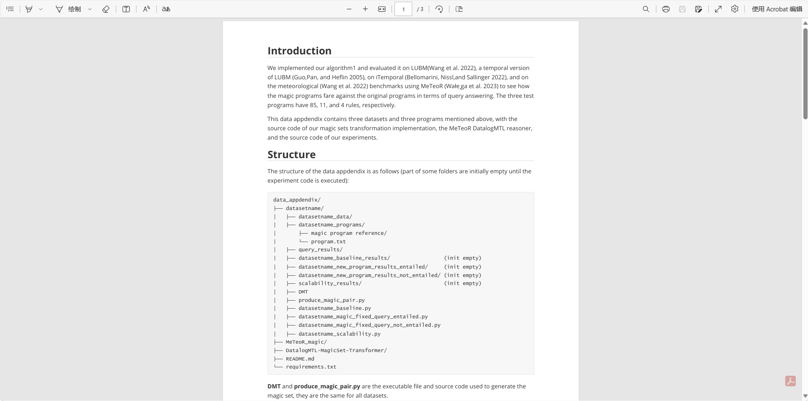

&emsp;&emsp;遥记得一开始接触 DatalogMTL 项目时，对其中的各种基本概念尚未熟悉、比如什么是 atom、什么是 canonical model。当时自己的内心里确实有一定的畏难情绪、不过大二上那几周，每天呆在实验室里的日子里，有不会的便能直接向胡老师请教，自己也是硬着头皮啃下了《Foundations Of Databases》中的基础及相关 Magic Sets 的几章内容，同样也在这时候、认识了后续实验中一直陪伴着的 MeTeoR 时序推理器（以及这篇经典的 AAAI-22 的文章）。从一次胡老师与同事 Przemek 的视频短会的 brainstorm 中、提到了是否可以基于 Magic Sets 方法进行 DatalogMTL 查询中的优化，并给了我几个对应的网站进行初步的测试，本次研究便开始于此。

&emsp;&emsp;一开始、我将传统的 Datalog 中的 Magic Sets 方法直接尝试迁移至 MTL 中。按照《EFFICIENT BOTTOM-UP COMPUTATION》一文中的的方法、我先对原有的程序进行了 adornment，随后根据 adorned program 进行了 magic program 的转换。但当时我感觉自己还是比较死脑筋的，在转换的过程中、并没有结合 MTL 的语义进行部分的修改、而是直接照搬了原先的经典方法，这导致当时我虽然发现在一些极小的样例上、基于转换后的 program，能够提升部分 query 的效率、不过也没法很好地去验证和证明其有效性。

&emsp;&emsp;好在是寒假过后、组里的韦同学（韦神！）根据他对于 MTL 语义的理解、提出了一种有效的转换 Magic 规则的方法、简单来说、便是在传统 Magic Sets 方法里，进行 literal 从 rule head 到 rule body、或是从 rule body 到 rule head 移动的时候、需要根据不同的情况进行 MTL operator 的变换，比如从 sometimes operator 变成 always operator。而是正基于此、我们的研究小组（胡老师，王学长，韦同学，我）便一起开始了后续的一系列研究。

&emsp;&emsp;不过当时由于学业和各种心理因素，一直推到了清明节放假期间、赶在了大创项目的中期答辩前、我基于先前张学长留下的部分代码的基础、修修改改、将 Magic Sets 程序转换的命令行原型及基础算法实现了出来（如上图所示）。大二下是软工专业最忙的一学期、我当时对于能够自己将该原型实现出来还是感到非常满意和有收获感的。不过、后续仍有一系列工作需要开展。

&emsp;&emsp;首先是需要将我们的 Magic Sets 转换后的 program 代入 MeTeoR 推理器进行正确性的验证和性能测试。在这个过程中，通过对 repo 中相关文件的研究，略有了一些掌握、并编写了一些 demo 的测试。不过、对于推理器本身的内部构造、我尚不是特别了解，因此当时也鼓起勇气向这篇 AAAI-22 的原作者汪学长进行了多次的 zoom meeting 进行细节上的询问，汪学长也耐心地解答我的疑问、并作为作者、修复了其中反映的几个 bug 和文档中的问题。（下面是当时为了询问而制作的 ppt）

&emsp;&emsp;后来在暑假小学期时，我们的测试工作进一步地进行。当时发生了一个问题：按照优化后的算法、我们需要将查询时间点对应的 magic fact 作为事实加入 dataset 中、但是在实际验证中、会出现如下的线性退化的情况、而无法用到 canonical representation 的性质，反而当需要查询的时间点变大之后、性能不如原有的方法（如下图所示，随时间线性增长，即为推理轮数和检查数的增长）。不过通过我的测试、若是将加入的 magic fact 的 time interval 变成正负时间轴上无穷的话、便可以在保证实验正确性的情况下、达到预期的优化性能。

&emsp;&emsp;到了暑假，正需要为了投稿作最后的冲刺工作。我负责完成实验测试的这一部分，当时虽然发烧生病了整整一周，但是还是坚持着每天推进一段任务。一开始，我对于实验测试的内容和方法，基本毫无头绪、可以说是完全不知道要做什么，不过和王学长讨论后，有了大概的思路。回到家、着手先开始写了下面这份实验计划、一点一点地模仿相关论文中所用到的实验方法，并学着生成了对应的 lubm 和 iTemporal 数据集，然后制表，最终完成了 Comparison 和 Scalability 两部分的实验。过程中也遇到了很多实现上的麻烦、不过最终都被一一化解。

&emsp;&emsp;完成实验后、在老师和学长的帮助下、最终我也交出了一份清晰明了的 data appendix 的内容，作为论文的一部分一同提交了上去。在得知我们的论文将会被 accepted 的时候、内心也是充满了喜悦与自豪感的。

